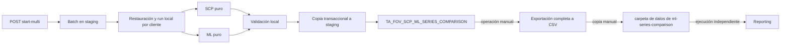
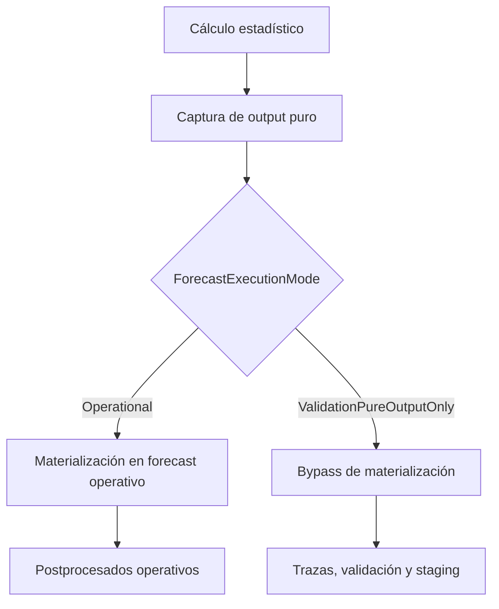

# Validación del Optimizador de Forecast: SCP frente a ML

> [!IMPORTANT]
> Este documento describe el flujo de cálculo implementado en `scp-backend`. El reporting pertenece al repositorio independiente `ml-series-comparison` y no se ejecuta como parte del backend. Una vez completado el cálculo, `TA_FOV_SCP_ML_SERIES_COMPARISON` se exporta manualmente y de forma completa a CSV; ese archivo se copia manualmente en la carpeta de datos del proyecto de reporting, que se ejecuta por separado.

## Estado exacto analizado

- Repositorio: `imperia-scm/scp-backend`.
- Rama: `refactor/fov-validation-cleanup`.
- HEAD: [`2b520fe4c4ad6cd66a3e5a6173b6c79cb95e78a9`](https://github.com/imperia-scm/scp-backend/commit/2b520fe4c4ad6cd66a3e5a6173b6c79cb95e78a9), `refactor(validation): remove unused single-client staging parameter`.
- Checkpoint validado: `fov-validation-pure-output-validated-20260803`.
- Commit apuntado por el tag: [`173034ac156d098db8410837d9e51e1c5e976bd2`](https://github.com/imperia-scm/scp-backend/commit/173034ac156d098db8410837d9e51e1c5e976bd2).
- Criterio de verdad: código de HEAD. El tag y la documentación anterior se usan como evidencia histórica.

La comprobación realizada antes de esta actualización muestra un único commit entre el checkpoint y HEAD. El diff afecta solo a [`SCP_Backend/API_SCP/Controllers/CalculationValidationOptimizerController.cs`](https://github.com/imperia-scm/scp-backend/blob/2b520fe4c4ad6cd66a3e5a6173b6c79cb95e78a9/SCP_Backend/API_SCP/Controllers/CalculationValidationOptimizerController.cs): elimina el parámetro privado sin uso `copyToSingleClientStaging` y el argumento nominal correspondiente, dos líneas en total. No existe una rama condicional asociada y no se observa un cambio funcional del flujo.

## Criterio de evidencia

- **Confirmado:** observado directamente en el código actual.
- **Documentado:** recogido en documentación o evidencias anteriores, pero no reproducido durante esta auditoría documental.
- **Evidencia manual:** resultado aportado de una validación ejecutada manualmente.
- **Inferencia:** consecuencia razonable del código.
- **Ambigüedad:** comportamiento que el código no resuelve inequívocamente.

## Contexto

El flujo de validación del Forecast Optimizer compara la ruta de previsión SCP existente con la ruta de ML durante los últimos seis meses cerrados. La comparación se materializa en staging como una fila por lote, ejecución, cliente y configuración de previsión.

La tabla de comparación objetivo es:

`TA_FOV_SCP_ML_SERIES_COMPARISON`

Sustituye conceptualmente al anterior artefacto de comparación ad hoc, pero no está condicionada por el nombre ni por las métricas de la tabla anterior.

Documentación relacionada:

- [Diccionario de datos](./forecast-optimizer-validation-scp-ml-data-dictionary.md)

## Flujos

La tabla de comparación se genera cuando los snapshots de validación se copian a staging desde:

- `/calculation-validation-optimizer/start-multi`

`/start-multi` crea un lote, devuelve `Batch queued` y procesa cada cliente secuencialmente dentro de un `Task.Run` en segundo plano. Cada ejecución de cliente se copia a staging mediante `CopyRunIntoBatchAsync` y, después, se actualiza `TA_FOV_SCP_ML_SERIES_COMPARISON` para ese lote, cliente y ejecución. La implementación se encuentra en `CalculationValidationOptimizerController.StartMulti` y `ProcessMultiClientBatchAsync` ([controlador fijado a HEAD](https://github.com/imperia-scm/scp-backend/blob/2b520fe4c4ad6cd66a3e5a6173b6c79cb95e78a9/SCP_Backend/API_SCP/Controllers/CalculationValidationOptimizerController.cs)).

`Batch queued` significa que la solicitud ha superado las comprobaciones previas, se ha creado la fila del lote en staging y se ha iniciado el proceso de servidor en segundo plano. No significa que todos los clientes hayan finalizado.

El endpoint multi-cliente acepta un máximo de 10 clientes por solicitud. Valida que exista usuario, que la lista de clientes no esté vacía, que no haya duplicados, que todos los identificadores sean positivos, que pueda resolverse la base de datos objetivo y que no exista ya un batch activo para ella. La respuesta inicial contiene el identificador de batch y no espera al resultado de los clientes.

Cuando se llama contra una URL de API remota, el trabajo en segundo plano se ejecuta en el proceso de la API remota, no en Visual Studio local. El riesgo operativo se mantiene: `Task.Run` es trabajo en memoria y el lote puede quedar interrumpido si el proceso remoto se recicla, se detiene, falla o se despliega de nuevo.

El controlador conserva endpoints de lectura, todos implementados como `POST`: `get-batch`, `get-batch-runs`, `get-batch-scp-series`, `get-batch-ml-series`, `get-run`, `get-results` y `get-summary`. Son endpoints operativos y de diagnóstico del backend; el proyecto de reporting no los consume.



## Fuentes

La comparación se construye a partir de snapshots de staging:

- `TA_FORECAST_OPTIMIZER_VALIDATIONS_STAGING` para el histórico y el snapshot de detalle heredado de validación.
- `TA_FOV_MODEL_OUTPUTS_STAGING` para las salidas mensuales puras de SCP y ML.
- `TA_FORECAST_OPTIMIZER_VALIDATION_SERIES_TRACE_STAGING` para el universo base de candidatos, indicadores de cálculo, exclusiones explícitas de ML, trazas SCP sin salida, niveles y señales de cobertura.
- `TA_FORECAST_OPTIMIZER_VALIDATION_ML_SERIES_STAGING` para los metadatos de modelo ML.
- `TA_FORECAST_OPTIMIZER_VALIDATION_SCP_SERIES_STAGING` solo para metadatos descriptivos de modelo SCP.

El staging de series SCP no es una fuente de métricas. Se usa únicamente para metadatos descriptivos porque su snapshot de error almacenado no es fiable para la comparación final SCP frente a ML.

La comparación pivota `TA_FOV_MODEL_OUTPUTS_STAGING` por mes calendario exacto y usa esos valores puros para los cálculos de previsión, error, métrica, ganador y mejora. La tabla heredada de staging de validación sigue siendo la fuente del histórico y conserva el contrato existente de detalle de validación.

La copia de un run y la reconstrucción de comparison están implementadas en `ForecastOptimizerValidationStagingCopyService.CopyRunIntoBatchAsync` y `RefreshSeriesComparisonAsync` ([servicio fijado a HEAD](https://github.com/imperia-scm/scp-backend/blob/2b520fe4c4ad6cd66a3e5a6173b6c79cb95e78a9/SCP_Backend/API_SCP/Models/ForecastOptimizerValidationStagingCopyService.cs#L395)). La copia se ejecuta dentro de una transacción de staging: crea o localiza el run staging, copia detalle, resumen, traza, outputs puros y metadatos SCP/ML, y refresca la comparación del scope. También se intenta para runs fallidos con objeto de conservar la evidencia parcial; un fallo de copia detiene el batch antes de restaurar el siguiente cliente.

## Evolución de Salidas Puras de Modelo

### Estado

- **Fase 1 - Implementada y validada:** SCP se captura antes del postprocesado operativo común y ML se captura desde `TA_FORECAST_ML_TEMP` en `TA_FOV_MODEL_OUTPUTS`.
- **Fase 2 - Implementada y validada:** las salidas locales se copian longitudinalmente a `TA_FOV_MODEL_OUTPUTS_STAGING` por lote, ejecución, cliente, configuración, motor y mes calendario.
- **Fase 3 - Implementada y validada:** `TA_FOV_SCP_ML_SERIES_COMPARISON` lee las salidas puras desde staging. El lote 91 se validó sin discrepancias frente al pivot independiente de salidas puras para las seis previsiones mensuales y sus errores firmado, absoluto y cuadrático.
- **Fase 4A - Implementada y validada:** las 36 columnas legacy de forecast, error absoluto y falso positivo pasan a admitir `NULL` tanto en `TA_FORECAST_OPTIMIZER_VALIDATIONS` como en `TA_FORECAST_OPTIMIZER_VALIDATIONS_STAGING`. La fase no modifica la fuente operativa actual de AUTO/OPT.
- **Fase 4B - Implementada y validada:** AUTO y OPT se cargan desde las salidas puras locales del run y la validación funcional del batch confirma el contrato nullable, la elegibilidad del resumen y la conservación de valores.
- **Fase 4C - Implementada y validada:** elimina físicamente los 12 campos mensuales y los 3 agregados legacy de falsos positivos del contrato actual, de las tablas locales y de staging.
- **Fase 4D.1 - Implementada y validada:** propaga un modo interno de ejecución de validación hasta los futuros puntos de corte SCP y ML, sin modificar todavía ningún flujo funcional. El smoke test del cliente `10406` en el batch `97` es idéntico al baseline del batch `96` al excluir identificadores técnicos y marcas temporales.
- **Fase 4D.2 - Implementada y validada:** el flujo ML de `start-multi` captura el output puro y omite el borrado y la materialización operativa, conservando cálculo, trazabilidad, limpieza y finalización común. El smoke del batch `99` del cliente `10406` coincide con el batch `97` en los resultados de validación.
- **Fase 4D.3 - Implementada y validada:** el flujo SCP de validación captura el output puro de la configuración lógica antes del postprocesado y omite exclusivamente su materialización operativa.
- **Fase 4D - Completada:** los bypasses de ML y SCP están validados conjuntamente sin cambios funcionales en los resultados de validación.

### Linaje

Linaje anterior del detalle heredado:

```text
modelo -> postprocesado operativo -> TA_OPERATIVE_FORECASTS -> detalle heredado AUTO/OPT
```

Linaje analítico actual de comparación:

```text
modelo -> TA_FOV_MODEL_OUTPUTS -> TA_FOV_MODEL_OUTPUTS_STAGING -> TA_FOV_SCP_ML_SERIES_COMPARISON
```

`0` es una previsión real y se mantiene diferenciada de una previsión no disponible (`NULL`). Las salidas puras negativas se conservan. El alcance de salidas puras queda aislado por lote, ejecución de staging, cliente, ejecución origen, configuración, motor y mes de previsión exacto; nunca utiliza un mecanismo alternativo a la previsión operativa.

El mapeo M6 a M1 usa el calendario de la ejecución: `M6 = RUN_START_DATE` y `M1 = RUN_START_DATE + 5 meses`.

### Modo interno de ejecución y bypass operativo

**Confirmado.** `ForecastExecutionMode` es un enum interno con los valores `Operational` y `ValidationPureOutputOnly`. No forma parte de HTTP, DTOs, entidades ni persistencia y su valor por defecto es `Operational`. `RunForecastOptimizerValidationAsync` activa explícitamente `ValidationPureOutputOnly` ([controlador, símbolo `RunForecastOptimizerValidationAsync`](https://github.com/imperia-scm/scp-backend/blob/2b520fe4c4ad6cd66a3e5a6173b6c79cb95e78a9/SCP_Backend/API_SCP/Controllers/CalculationValidationOptimizerController.cs#L1728)).

La formulación funcional exacta es: **la validación captura los outputs estadísticos puros de SCP y ML y evita su materialización como forecast operativo**. `ForecastExecutionModePolicy.ShouldExecuteOperationalForecastFlow` centraliza la distinción entre ambos modos ([política fijada a HEAD](https://github.com/imperia-scm/scp-backend/blob/2b520fe4c4ad6cd66a3e5a6173b6c79cb95e78a9/SCP_Backend/API_SCP/Models/ForecastExecutionModePolicy.cs)).

Esto no equivale a ausencia absoluta de escrituras. Antes y alrededor del cálculo pueden ejecutarse normalizaciones previas, truncados de tablas temporales, cambios y restauración de configuración, y escrituras de runs, progreso, trazas, outputs puros, detalle, resumen y staging. El bypass tiene como alcance la persistencia del forecast calculado en `TA_OPERATIVE_FORECASTS` y los pasos operativos posteriores asociados; no convierte todo el proceso en solo lectura.



#### SCP

**Confirmado.** SCP clasifica cada llamada a `CalculateForecastSingleConfiguration` como `LogicalOwner`, `ParentBehaviourAuxiliary` o `MlFallbackAuxiliary`. Solo `LogicalOwner` en `ValidationPureOutputOnly` aplica el corte. Crea el snapshot mensual soportado, espera a `ForecastModelOutputCaptureService.CaptureScpAsync`, marca `Captured` y devuelve un `DataTable` válido y vacío para impedir la operacionalización. Si la ruta no ofrece un snapshot soportado, el resultado queda `NoOutput`, la traza usa `NoPureOutputAvailable` y tampoco se materializa ([`ForecastCalculationModel.CalculateForecastSingleConfiguration`](https://github.com/imperia-scm/scp-backend/blob/2b520fe4c4ad6cd66a3e5a6173b6c79cb95e78a9/SCP_Backend/API_SCP/Models/ForecastCalculationModel.cs#L13655), [corte y captura](https://github.com/imperia-scm/scp-backend/blob/2b520fe4c4ad6cd66a3e5a6173b6c79cb95e78a9/SCP_Backend/API_SCP/Models/ForecastCalculationModel.cs#L14572)).

Las llamadas `ParentBehaviourAuxiliary` y `MlFallbackAuxiliary` no son propietarias de la serie lógica: no capturan el output final ni aplican el retorno anticipado. Deben completar transformaciones en memoria que consume la llamada propietaria. `LogicalOwner` sí delimita el output atribuible a la configuración y evita que una invocación auxiliar genere una captura duplicada o incompleta.

En modo `Operational`, la captura SCP exterior y el flujo de rates, review, buffer, bulk copy, merge y sincronización mantienen el comportamiento operativo. En validación, las guardas globales omiten esos pasos cuando `ShouldExecuteOperationalForecastFlow` devuelve `false`.

#### ML

**Confirmado.** ML calcula y deposita su resultado estadístico en `TA_FORECAST_ML_TEMP`; `CaptureMlAsync` lo captura antes de cualquier copia al forecast operativo. En `ValidationPureOutputOnly`, la ruta omite el borrado previo de backfill, la copia a `TA_OPERATIVE_FORECASTS` y los postprocesados operativos, y registra `ForecastPureOutputCaptured` ([`MLForecastModel`](https://github.com/imperia-scm/scp-backend/blob/2b520fe4c4ad6cd66a3e5a6173b6c79cb95e78a9/SCP_Backend/API_SCP/Models/MLForecastModel.cs#L609), [`OperativeForecastModel`](https://github.com/imperia-scm/scp-backend/blob/2b520fe4c4ad6cd66a3e5a6173b6c79cb95e78a9/SCP_Backend/API_SCP/Models/OperativeForecastModel.cs#L541)).

Se conservan el cálculo ML, su tabla temporal, la captura, las trazas, el progreso, la copia de logs, la respuesta, el token y la limpieza de temporales. El fallback SCP invocado desde ML usa el rol `MlFallbackAuxiliary`: puede ejecutar transformaciones en memoria necesarias para producir ML, pero no se presenta como output SCP propietario.

### Evidencia manual aportada: batch 103

**Evidencia manual, no reproducida durante esta auditoría documental.** El batch `103` se reportó como completado con:

- 17 configuraciones.
- 48 outputs mensuales SCP y 42 outputs mensuales ML.
- 6 configuraciones comparables.
- 4 ganadores ML y 2 ganadores SCP.
- Revisión de métricas, agregados, ganadores, detalle y tabla de comparación.
- Igualdad de los 48 outputs SCP frente al baseline válido del mismo periodo.
- Configuración `19` con `HAS_SCP_CALCULATED = 0`, `COMPARISON_STATUS = 'NOT_COMPARABLE_MISSING_SCP'` y motivo `NoPureOutputAvailable`.

En la sesión y ventana de observación configuradas de Extended Events no se detectaron escrituras correspondientes a la materialización operativa que se pretendía excluir. Esta evidencia limitada no demuestra que no se ejecutara ninguna otra mutación: quedan fuera de esa conclusión, entre otras, las normalizaciones previas y los truncados de temporales.

### Restricción de diseño de Fase 4B

La Fase 4B debe recuperar y validar primero todas las filas de salidas puras del motor objetivo y de la ventana de seis meses de la ejecución. Solo cuando esa lectura termine correctamente puede aplicar los valores al objeto de validación en memoria. No debe limpiar ni reinicializar los campos objetivo antes de que la lectura de origen haya finalizado con éxito.

La implementación valida que el run existe, que pertenece al cliente solicitado y que contiene `START_DATE`. A partir de esa fecha carga en bloque los outputs de `TA_FOV_MODEL_OUTPUTS` de cada motor y construye un mapa por configuración y mes calendario. `SCP` modifica únicamente `AUTO_M1..AUTO_M6`; `ML`, únicamente `OPT_M1..OPT_M6`. No hay fallback a `TA_OPERATIVE_FORECASTS`: un output ausente se conserva como `NULL`, mientras que `0` y los valores negativos se mantienen sin transformación.

Los errores y porcentajes mensuales son `NULL` cuando falta el forecast correspondiente. El detalle conserva todas las configuraciones; el resumen solo agrega configuraciones con los seis AUTO y los seis OPT informados. `CONFIGURATIONS_TOTAL` continúa representando el universo completo. Si no hay configuraciones elegibles, los agregados y porcentajes del resumen se mantienen en `0` para evitar divisiones por cero.

Los falsos positivos legacy se retiraron del cálculo en Fase 4B por falta de fundamento metodológico. Fase 4C elimina físicamente `AUTO_FALSE_POSITIVE_M1..M6`, `OPT_FALSE_POSITIVE_M1..M6`, `AUTO_FALSE_POSITIVES`, `OPT_FALSE_POSITIVES` y `FALSE_POSITIVE_IMPROVEMENT` de entidades, DTOs, contratos JSON, detalle local, resumen local y staging. La migración `RemoveForecastOptimizerValidationFalsePositiveFields` conserva las migraciones históricas: su `Down` repone los 12 campos de detalle como `INT NULL` y los tres agregados como `INT NOT NULL DEFAULT 0`, pero no recupera valores eliminados.

El preflight de staging elimina cada columna retirada de forma idempotente. Solo elimina el `DEFAULT CONSTRAINT` asociado directamente a esa columna; si detecta un índice, clave foránea, check constraint o dependencia de expresión, detiene el proceso con un error descriptivo y no elimina esa dependencia. La retirada no modifica forecasts, errores absolutos, porcentajes de error, elegibilidad, ganadores ni la comparación de Fase 3.

Se mantienen las limitaciones actuales de cobertura: no todas las estrategias SCP producen un snapshot soportado y `CopyLastYear` queda fuera de la captura pura. En esas rutas la ausencia se conserva como tal; no se sustituye por forecast operativo. Los bypasses SCP y ML están activos en `ValidationPureOutputOnly`, con el alcance preciso descrito arriba.

### Evidencia de validación de Fase 4B

El nuevo batch de validación terminó correctamente con `CONFIGURATIONS_TOTAL = 17`, `SCP_COMPLETE = 7`, `ML_COMPLETE = 7` y `ELIGIBLE = 6`. Las configuraciones elegibles fueron `6`, `14`, `18`, `20`, `23` y `24`.

- `AUTO_*` se alimenta de outputs puros `SCP` y `OPT_*` de outputs puros `ML`; `TA_OPERATIVE_FORECASTS` ya no participa en esas dos cargas.
- El histórico continúa procediendo de `TA_WAREHOUSE_OUTPUTS`.
- Las ausencias de outputs puros se persisten como `NULL`; los valores cero y negativos se conservan.
- Las configuraciones incompletas permanecen en el detalle, pero no participan en el resumen.
- Los falsos positivos legacy ya no forman parte del contrato actual; la retirada física se validó en Fase 4C.
- `SCP_BETTER_CONFIGURATIONS + ML_BETTER_CONFIGURATIONS + TIED_CONFIGURATIONS = 6`.
- `TA_FOV_SCP_ML_SERIES_COMPARISON` conserva la distribución esperada: `COMPARABLE = 6`, `NOT_COMPARABLE_MISSING_SCP = 1`, `NOT_COMPARABLE_MISSING_SCP_AND_ML = 9` y `NOT_COMPARABLE_ML_EXCLUDED = 1`.

### Evidencia de validación de Fase 4C

El batch `96` para el cliente `10406` finalizó correctamente después de aplicar `20260731123900_RemoveForecastOptimizerValidationFalsePositiveFields`; el run staging fue `93` y el run origen fue `1`.

- Las 15 columnas eliminadas no existen ni en las tablas locales ni en las tablas de staging, y `__EFMigrationsHistory` registra tanto `20260731091529_MakeForecastOptimizerValidationFieldsNullable` como la migración de Fase 4C.
- El detalle conserva `17` configuraciones y `6` elegibles. El resumen cumple `SCP_BETTER_CONFIGURATIONS = 3`, `ML_BETTER_CONFIGURATIONS = 3`, `TIED_CONFIGURATIONS = 0` y su suma es `6`.
- Se preservaron `48` outputs SCP y `42` outputs ML. La comparación directa de las seis fechas de cada motor no encontró discrepancias entre los outputs puros, los forecasts del detalle, sus errores absolutos ni sus porcentajes.
- La comparación de Fase 3 se mantiene en `COMPARABLE = 6`, `NOT_COMPARABLE_MISSING_SCP = 1`, `NOT_COMPARABLE_MISSING_SCP_AND_ML = 9` y `NOT_COMPARABLE_ML_EXCLUDED = 1`.
- Los endpoints `get-results` y `get-summary` devuelven el contrato actualizado sin propiedades `FALSE_POSITIVE` ni `FalsePositive`.

La retirada funcional de falsos positivos quedó validada en Fase 4B y su retirada física queda validada en Fase 4C.

### Evidencia de validación de Fase 4A

El lote 92 finalizó correctamente para el cliente `10406` después de aplicar la migración `MakeForecastOptimizerValidationFieldsNullable`.

- `TA_FORECAST_OPTIMIZER_VALIDATIONS` y `TA_FORECAST_OPTIMIZER_VALIDATIONS_STAGING` contienen las 36 columnas objetivo como nullable.
- `__EFMigrationsHistory` registra `MakeForecastOptimizerValidationFieldsNullable`.
- Los resultados funcionales del lote 92 coinciden con los del lote 91; solo cambian identificadores técnicos y timestamps.
- La distribución de estados de comparación se mantiene: `COMPARABLE = 6`, `NOT_COMPARABLE_MISSING_SCP = 1`, `NOT_COMPARABLE_MISSING_SCP_AND_ML = 9` y `NOT_COMPARABLE_ML_EXCLUDED = 1`.
- La captura conserva la ventana de enero a junio de 2026: 48 filas SCP para 9 configuraciones y 42 filas ML para 7 configuraciones.
- Los forecasts, errores, métricas, estados, modelos y ganadores de la comparación no cambian funcionalmente entre los lotes 91 y 92.

### Incidencia del preflight de staging

Durante la primera ejecución de Fase 4A, `EnsureStagingTablesAsync` falló antes de crear el lote con el error SQL `Incorrect syntax near 'QUOTENAME'`. La causa era intentar concatenar `QUOTENAME(...)` directamente dentro de `EXEC(...)`.

La corrección construye primero la sentencia `ALTER COLUMN` completa en `@FovAlterColumnSql` y la ejecuta mediante `sys.sp_executesql`. Se conservan el cursor, la comprobación `column_info.is_nullable = 0` y el conjunto de 36 columnas. Tras la corrección, `/calculation-validation-optimizer/start-multi` vuelve a ejecutar correctamente el preflight y el batch.

## Convención mensual

`M1` es el mes cerrado más reciente.

Para una ejecución realizada en julio:

- `M1` = junio
- `M2` = mayo
- `M3` = abril
- `M4` = marzo
- `M5` = febrero
- `M6` = enero

## Ventanas temporales

- `OLDER_3M = M6 + M5 + M4`
- `RECENT_3M = M3 + M2 + M1`
- `6M = M1 + M2 + M3 + M4 + M5 + M6`

Las métricas de ventana se calculan desde componentes base, no como medias de porcentajes mensuales.

## Comparabilidad

La tabla parte del universo `BASE/Candidate` y conserva las filas no comparables para el análisis de cobertura.

La cobertura responde cuántas series candidatas alcanzaron cada etapa. La cobertura y los porcentajes de descarte usan el universo `BASE/Candidate` como denominador.

La comparación responde qué método obtuvo mejor resultado. Los porcentajes de ganador, mejora, error y distribución de modelos usan únicamente filas con `COMPARISON_STATUS = 'COMPARABLE'`.

Los campos `HAS_*` y los campos de motivo son la fuente canónica para el análisis de cobertura y descarte. `COMPARISON_STATUS` es un resumen operativo por fila y no debe ser la única fuente para el informe detallado de descartes.

`TA_FOV_SCP_ML_SERIES_COMPARISON` es la tabla base para el informe analítico. No sustituye a `TA_FORECAST_OPTIMIZER_VALIDATION_RUNS` ni a `TA_FORECAST_OPTIMIZER_VALIDATION_RUNS_STAGING` como tablas de monitorización operativa.

Indicadores y motivos por fila:

- `HAS_BASE_CANDIDATE`: la fila pertenece al universo base de candidatos.
- `HAS_SCP_CALCULATED`: la traza contiene `ENGINE = 'SCP'` y `STAGE = 'Calculated'`.
- `HAS_ML_CALCULATED`: la traza contiene `ENGINE = 'ML'` y `STAGE = 'Calculated'`.
- `HAS_ML_EXCLUDED`: la traza contiene `ENGINE = 'ML'` y `STAGE = 'Excluded'`.
- `ML_EXCLUSION_REASON`: `REASON` ordenado de una fila de traza ML excluida.
- `SCP_NO_OUTPUT_REASON`: último `REASON` de una traza con `ENGINE = 'SCP'` y `STAGE = 'NoOutput'`.

Si existen varios motivos de exclusión ML para una misma serie, se selecciona uno de forma determinista:

- `NewRelease`
- `ShortSeries`
- `MissingHistory`
- cualquier otro motivo, por texto del motivo, después la última `REFERENCE_DATE` y, por último, el id de traza más reciente.

SCP no emite actualmente un equivalente explícito de `ENGINE = 'SCP'` y `STAGE = 'Excluded'`. Por tanto, no existe el indicador `HAS_SCP_EXCLUDED` ni un estado activo `NOT_COMPARABLE_SCP_EXCLUDED` en esta fase.

`SCP NoOutput` significa que la ruta SCP propietaria no produjo un snapshot puro soportado; el motivo actual es `NoPureOutputAvailable`. No debe interpretarse como una exclusión explícita de SCP ni como una previsión de valor cero.

Una fila es `COMPARABLE` cuando:

- `HAS_BASE_CANDIDATE = 1`.
- `HAS_ML_EXCLUDED = 0`.
- existe información de validación en staging.
- existen los seis valores de histórico y su suma es positiva.
- existen los seis valores de previsión SCP.
- existen los seis valores de previsión ML.

El valor de previsión `0` es válido y significa que el método calculó una previsión real de cero. El valor `NULL` significa que la previsión no está disponible o no se ha calculado.

`HAS_SCP_CALCULATED` y `HAS_ML_CALCULATED` proceden de la existencia de trazas `Calculated`, pero son indicadores de auditoría, no condiciones de comparabilidad. Una traza puede existir sin seis outputs y seis outputs pueden ser la evidencia decisiva aunque falte la traza, porque las trazas se escriben en modo *best effort*. Los forecasts de comparison proceden del pivot de `TA_FOV_MODEL_OUTPUTS_STAGING`; no se fuerzan a `NULL` por el valor de esos flags.

Precedencia de `COMPARISON_STATUS`:

- `NOT_COMPARABLE_RUN_FAILED`
- `NOT_COMPARABLE_MISSING_VALIDATION`
- `NOT_COMPARABLE_MISSING_SCP_AND_ML`
- `NOT_COMPARABLE_ML_EXCLUDED`
- `NOT_COMPARABLE_MISSING_SCP`
- `NOT_COMPARABLE_MISSING_ML`
- `NOT_COMPARABLE_NO_HISTORY`
- `COMPARABLE`

`NOT_COMPARABLE_RUN_FAILED` tiene prioridad sobre `NOT_COMPARABLE_MISSING_VALIDATION`. Si la fila de ejecución en staging está en estado fallido, la fila de comparación se marca como ejecución fallida incluso cuando nunca se produjo información de validación.

El estado operativo, el progreso y el detalle completo de errores permanecen en:

- `TA_FORECAST_OPTIMIZER_VALIDATION_RUNS`
- `TA_FORECAST_OPTIMIZER_VALIDATION_RUNS_STAGING`

Para filas no comparables, los campos de ganador, finalista y mejora permanecen nulos.

## Métricas

Métrica principal:

- `WAPE`

Métricas de auditoría:

- `MAE`
- `RMSE`
- `Bias`

Definiciones:

- `SIGNED_ERROR = FORECAST - HISTORY`
- `Bias = TOTAL_SIGNED_ERROR / TOTAL_HISTORY`
- `MAE = TOTAL_ABS_ERROR / número de meses con histórico positivo`
- `RMSE = SQRT(TOTAL_SQUARED_ERROR / número de meses con histórico positivo)`
- `WAPE = TOTAL_ABS_ERROR / TOTAL_HISTORY`

Si un periodo no tiene histórico positivo o no puede dividirse de forma segura, sus métricas normalizadas y campos de ganador permanecen nulos.

## Métricas descartadas

La tabla de comparación no incluye:

- `MAPE`
- `sMAPE`
- mejora asimétrica frente a un método fijo
- columnas independientes de mejora de error absoluto

La métrica de mejora de negocio se basa en el ganador frente al finalista.

## Reglas de ganador

Los ganadores se calculan solo para filas comparables y solo en periodos donde estén disponibles ambos WAPE, SCP y ML.

Regla de empate:

```text
relativeDiff = ABS(SCP_WAPE - ML_WAPE) / NULLIF(MAX(SCP_WAPE, ML_WAPE), 0)
```

El resultado es empate cuando `relativeDiff < 0.0001`. Si ambos WAPE son cero, el resultado también es empate.

Cuando gana ML:

- `WINNER_METHOD = ML`
- `WINNER_MODEL = ML_BEST_MODEL`
- `FINALIST_METHOD = SCP`
- `FINALIST_MODEL = SCP_BEST_MODEL`

Cuando gana SCP:

- `WINNER_METHOD = SCP`
- `WINNER_MODEL = SCP_BEST_MODEL`
- `FINALIST_METHOD = ML`
- `FINALIST_MODEL = ML_BEST_MODEL`

Cuando hay empate:

- `WINNER_METHOD = TIE`
- los campos de modelo y finalista permanecen nulos
- `WINNER_IMPROVEMENT_PCT = 0`

## Mejora

```text
WINNER_IMPROVEMENT_PCT =
    ((FINALIST_WAPE - WINNER_WAPE) / FINALIST_WAPE) * 100
```

Si el WAPE del finalista no puede usarse con seguridad como denominador, la mejora permanece nula salvo en los empates, donde vale `0`.

## Cobertura

La tabla de comparación solo almacena indicadores por fila:

- `HAS_BASE_CANDIDATE`
- `HAS_SCP_CALCULATED`
- `HAS_ML_CALCULATED`
- `HAS_ML_EXCLUDED`

La tabla de comparación también almacena motivos observables:

- `ML_EXCLUSION_REASON`
- `SCP_NO_OUTPUT_REASON`

Estos indicadores y motivos quedan consolidados en la propia fila de comparación. Las trazas y tablas de metadatos de staging explican cómo se construyeron, pero son fuentes internas del backend.

## Frontera de entrega al proyecto de reporting

La responsabilidad de `scp-backend` termina cuando `TA_FOV_SCP_ML_SERIES_COMPARISON` se ha construido correctamente. Esa tabla contiene la unidad autocontenida que se entrega al proceso independiente de reporting.

El procedimiento real de intercambio es:

1. Exportar **la tabla completa** `TA_FOV_SCP_ML_SERIES_COMPARISON` a un archivo CSV.
2. No seleccionar columnas manualmente ni reconstruir métricas durante la exportación.
3. Copiar manualmente el CSV en la carpeta de datos del repositorio `ml-series-comparison`.
4. Ejecutar el reporting por separado, conforme al comportamiento de ese repositorio.

No hay conexión directa de reporting a staging, consumo de endpoints del backend, API de transferencia, ETL compartido ni integración automática entre repositorios. Tampoco corresponde a reporting unir batches, runs, outputs longitudinales, detalle, summaries, trazas o metadatos. Esas tablas existen para cálculo, reconstrucción, auditoría y trazabilidad internas, pero no forman parte del intercambio.

La documentación de fuentes internas de este informe explica el linaje de `TA_FOV_SCP_ML_SERIES_COMPARISON`; no prescribe lecturas multi-tabla al proyecto de reporting.

## Riesgos operativos

- La ejecución en segundo plano de la API puede interrumpirse por reciclado o despliegue del proceso.
- Una llamada remota a la API se ejecuta en el proceso remoto; cerrar Visual Studio local no la detiene.
- `Task.Run` no es una cola persistente. El reciclado de la API, un fallo, un despliegue, un reinicio del application pool o del contenedor pueden interrumpir un lote en cola o en ejecución.
- La restauración de base de datos requiere permisos y rutas en el servidor.
- La cadena de conexión de staging debe estar configurada por entorno.
- El acceso a la base de datos ML depende del nombre y de los permisos esperados.
- Las filas de traza deben agregarse por existencia para evitar filas duplicadas en la comparación.
- Los motivos de exclusión ML deben ordenarse para evitar filas duplicadas en la comparación.
- Los runs fallidos pueden producir datos parciales en staging.
- Los metadatos de modelo pueden faltar aunque los forecasts sigan siendo comparables.
- Los batches históricos existentes no se completan retrospectivamente con este cambio. Es necesario relanzar el cálculo o ejecutar un script de backfill independiente para datos antiguos.
