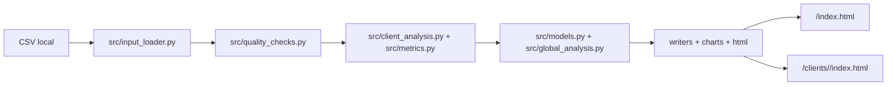
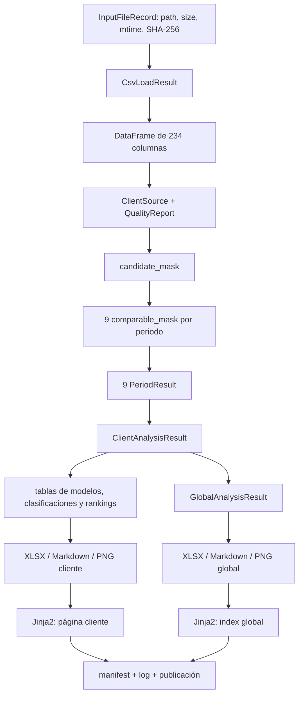
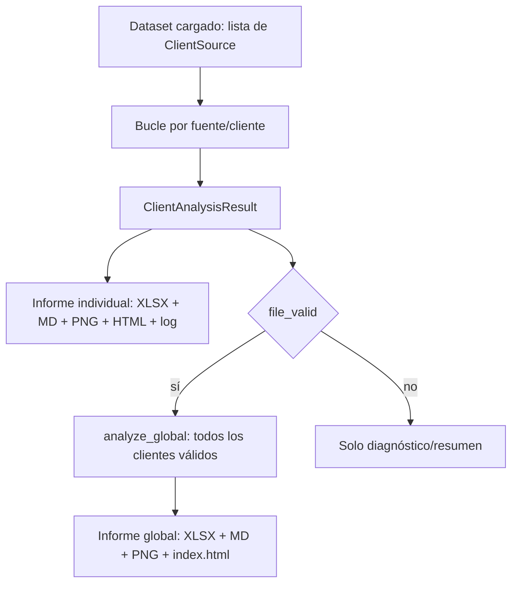
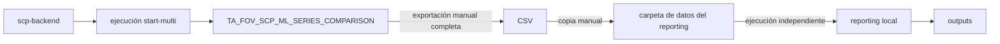
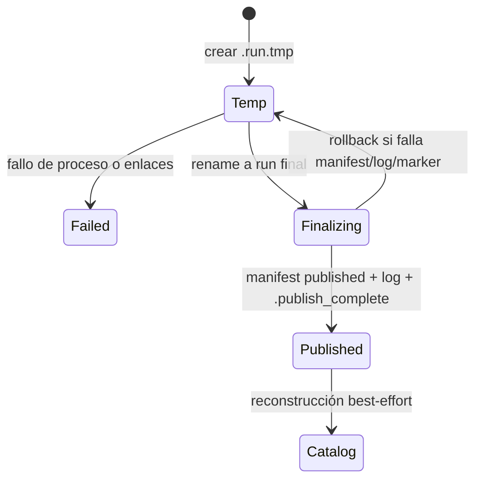

# Flujo técnico de reporting SCP frente a ML

## 1. Resumen ejecutivo

Este repositorio construye informes retrospectivos para comparar, por serie de forecast, el resultado del método operativo SCP con el resultado de ML. La métrica principal es WAPE; MAE, RMSE y Bias se tratan como métricas de auditoría. El sistema calcula cobertura, ganadores, mejora relativa de ML frente a SCP, reducción absoluta de error, estadísticas por serie, análisis por modelo y clasificación, rankings y cuatro perspectivas globales entre clientes.

**Confirmado por código.** El flujo ejecutable actual es completamente local y basado en archivos:

`CSV -> pandas -> validación/calidad -> análisis por cliente y periodo -> análisis global -> Excel/Markdown/PNG -> HTML offline -> manifest/log -> publicación de una ejecución`.

No existe acceso a SQL Server, llamadas al backend, joins con staging ni integración automática. `docs/backend-validation-flow.md` se usa en este informe únicamente para explicar el origen y la semántica de `TA_FOV_SCP_ML_SERIES_COMPARISON`.

**Conclusión de compatibilidad.** El contrato de columnas es muy cercano al de la tabla de comparación: los 24 CSV históricos inspeccionados tienen un único esquema de 234 columnas y coinciden exactamente con las 234 columnas obligatorias del lector. Sin embargo, el formato operativo futuro confirmado —un único CSV con la exportación completa de la tabla— **no es procesable correctamente por el código actual** si contiene más de un cliente: `check_single_client` lo marca `MULTIPLE_CLIENTS_IN_CSV`, el fichero queda inválido y no se calcula ningún periodo. Tampoco existe selección de batch o run; si se evitara ese error sin definir el grano, se podrían mezclar ejecuciones y ventanas temporales.

**Divergencia operativa actual.** El valor por defecto de `--input-dir` es `<repo>/data`, pero el commit analizado movió todos los CSV a subcarpetas. En el estado inspeccionado hay cero `data/*.csv` y 24 `data/**/*.csv`; como el descubrimiento no es recursivo, el comando sin argumentos termina con código 1 por ausencia de CSV. Para usar los ejemplos presentes hay que indicar expresamente una carpeta hija.

## 2. Repositorio, rama y commit analizados

| Dato | Valor | Evidencia |
|---|---|---|
| Repositorio local | `C:\Projects\AdhocReports\fov_scp_ml_analysis` | Entorno y `git remote -v` |
| Remote | `origin = https://github.com/Imperia-Aladeras/fov-scp-ml-analysis.git` | `git remote -v` |
| Rama | `feature/per-client-multi-period-analysis` | `git branch --show-current` |
| HEAD | `d9d2d3a39fde705b0dee2c14390f0d44ded3e929` | `git rev-parse HEAD` |
| Último commit | `d9d2d3a punto de control 28072026` | `git log -1 --oneline` |
| Rama base real | `main` / `origin/main` | Únicas ramas base disponibles y grafo Git |
| Merge-base | `f70bf49dcbdde093c233cf956e36fc9341e2a54e` | `git merge-base HEAD main` y `git merge-base --all HEAD origin/main` |
| Diferencia respecto a base | 0 commits solo en `main`; 13 solo en feature | `git rev-list --left-right --count main...HEAD` -> `0 13` |
| Estado inicial | `docs/backend-validation-flow.md` ya era untracked; ningún otro cambio | `git status` |

La rama base no se ha supuesto: `main` y `origin/main` apuntan a `f70bf49`, ese commit es el ancestro común y no hay ninguna otra rama local/remota candidata. La rama aporta 330 paths frente a la base: 27 en `src`, 23 en `tests`, 24 en `data`, 242 outputs históricos, seis templates, dos assets y varios documentos/archivos raíz. Los commits propios introducen, por orden, requisitos, núcleo multiperiodo, reporting individual, reporting global, ejecuciones versionadas, HTML offline, catálogo histórico y documentación de CSV; los demás commits incorporan datos y outputs de ejemplo.

El último commit `d9d2d3a` solo reorganiza/incorpora los 24 CSV: mueve siete desde `data/` a `data/exportacion_14072026/` y añade las colecciones `exportacion_20072026` y `no_comparables`. No adapta el descubrimiento no recursivo ni el ejemplo sin argumentos.

## 3. Alcance y criterio de evidencia

Se han usado, por prioridad: código de la rama, tests, configuración, historial Git, documentación y artefactos existentes. No se ha ejecutado el pipeline ni se han generado HTML, Excel, CSV o imágenes.

Las etiquetas usadas son:

- **Confirmado por código:** comportamiento observado en la implementación actual.
- **Documentado:** afirmación de README, comentarios, commits o documentación que no se ha reproducido completamente.
- **Inferencia:** consecuencia razonable de código o artefactos.
- **Ambigüedad:** las fuentes disponibles no permiten una conclusión única.

Los outputs existentes se han usado solo para comprobar estructura y tamaños. `docs/backend-validation-flow.md` era un archivo preexistente no versionado y no se ha modificado.

## 4. Problema que resuelve y arquitectura

**Confirmado por código.** Cada fila representa una configuración/serie identificada principalmente por `ID_CLIENT` e `ID_CONFIGURATION`, dentro de un batch/run. Para nueve periodos técnicos (`M1..M6`, `RECENT_3M`, `OLDER_3M`, `6M`), el proyecto:

1. determina la población candidata y comparable;
2. compara error SCP y ML;
3. conserva como fuente de verdad el ganador suministrado por el CSV;
4. agrega resultados dentro de un cliente y entre clientes;
5. materializa artefactos navegables y auditables por ejecución.

El diseño tiene tres capas principales:

| Capa | Módulos | Responsabilidad |
|---|---|---|
| Orquestación y ejecución | `analysis_fov_scp_ml.py`, `run_config.py`, `input_inventory.py`, `manifest.py`, `run_publish.py` | CLI, rutas, integridad, ciclo de vida y publicación |
| Dominio analítico | `input_loader.py`, `periods.py`, `quality_checks.py`, `metrics.py`, `client_analysis.py`, `models.py`, `global_analysis.py` | Lectura, contrato, universos, métricas y análisis |
| Presentación | writers Excel/Markdown, charts, `html_*`, templates y CSS | Artefactos individuales/globales y HTML offline |

## 5. Inventario del repositorio

No hay notebooks, `pyproject.toml`, archivos YAML/TOML/INI, Dockerfile, Makefile, scripts `.sh`/`.ps1` ni archivos `.env` versionados. Hay 51 archivos Python: el entrypoint, 27 módulos en `src` (incluido `__init__.py`) y 23 archivos de tests.

### 5.1 Código y recursos

| Elemento | Responsabilidad | Invocado por | Entrada | Salida/efecto | Estado |
|---|---|---|---|---|---|
| `analysis_fov_scp_ml.py` | Entrypoint y orquestación completa | Usuario/CLI | Argumentos y CSV | Run publicado, consola, código de salida | CORE |
| `src/input_loader.py` | Descubrimiento, parseo defensivo, coerción y fuentes por cliente | Orquestador | `*.csv` directos | `ClientSource[]` en memoria | CORE |
| `src/periods.py` | Contrato de periodos y 234 columnas obligatorias | Loader y análisis | Nombre de periodo | `PeriodColumns`, listas | CORE |
| `src/quality_checks.py` | Validaciones estructurales y numéricas | Loader/análisis | DataFrames | `QualityIssue`/`QualityReport` | CORE |
| `src/metrics.py` | WAPE agregado, mejora, reducción y descriptivos | Análisis cliente/global | Subconjuntos comparables | diccionarios/Series | CORE |
| `src/client_analysis.py` | Universo y resultados de nueve periodos por cliente | Orquestador | `ClientSource` | `ClientAnalysisResult` | CORE |
| `src/models.py` | Modelos, clasificaciones y rankings | Writers/charts/HTML/global | DataFrame + máscara 6M | tablas pandas | CORE |
| `src/global_analysis.py` | Cuatro perspectivas globales y tablas por cliente | Orquestador | Resultados válidos | `GlobalAnalysisResult` | CORE |
| `src/charts.py` | Hasta 29 PNG por cliente | Orquestador | Resultado cliente | PNG | CORE |
| `src/global_charts.py` | Hasta 15 PNG globales | Orquestador | Resultado global | PNG | CORE |
| `src/excel_writer.py` | Workbook individual de 14 hojas | Orquestador | Resultado cliente | XLSX | CORE |
| `src/global_excel_writer.py` | Workbook global de 16 hojas | Orquestador | Resultado global | XLSX | CORE |
| `src/report_writer.py` | Informe individual de 18 secciones | Orquestador | Resultado cliente | texto Markdown | CORE |
| `src/global_report_writer.py` | Informe global de 21 secciones | Orquestador | Resultado global | texto Markdown | CORE |
| `src/html_view_models.py` | Adaptación y texto de presentación | `html_report.py` | Resultados calculados | diccionarios para templates | CORE |
| `src/html_formatters.py` | N/D, formatos es-ES, fechas y URLs | HTML y catálogo | valores | strings | CORE |
| `src/html_report.py` | HTML global/cliente, assets y validación de enlaces | Orquestador/catálogo | resultados y rutas | HTML + CSS copiado | CORE |
| `src/input_inventory.py` | Inventario SHA-256 y comprobación de inmutabilidad | Orquestador | CSV | registros; excepciones de integridad | CORE |
| `src/execution_summary.py` | Resumen por CSV | Orquestador | inventario/resultados | MD + XLSX | CORE |
| `src/logging_utils.py`, `execution_log.py` | Logs de cliente y líneas del log global | Orquestador | resultados/eventos | texto | CORE |
| `src/run_config.py` | Parser, saneamiento y rutas tipadas | Entrypoint | CLI | `RunConfig` | CORE |
| `src/manifest.py`, `version.py` | Proveniencia, resumen estable y versión `1.0.0` | Orquestador/publicación/catálogo | ejecución/resultados | JSON | CORE |
| `src/run_publish.py` | Publicación con temp/backup/marker y recuperación | Entrypoint | directorios de run | renombres/escrituras | CORE |
| `src/run_catalog.py`, `run_catalog_models.py` | Índice histórico de runs, sin recalcular métricas | Entrypoint alternativo | manifests publicados | HTML/CSS/log de catálogo | AUXILIARY |
| `templates/base.html`, `global_report.html`, `client_report.html`, `components/*` | Plantillas de informes | `html_report.py` | view models | HTML | CORE |
| `templates/run_catalog.html`, `report_assets/catalog_styles.css` | Catálogo de runs | `run_catalog.py` | manifests | HTML/CSS | AUXILIARY |
| `report_assets/styles.css` | Estilo local del informe | `html_report.py` | fichero estático | copia en run | CORE |
| `src/__init__.py` | Marca de paquete | Imports Python | — | — | AUXILIARY |

### 5.2 Tests, documentación, datos y artefactos

| Elemento | Responsabilidad/uso | Estado |
|---|---|---|
| `tests/*.py`, `tests/factories.py` | 341 casos recolectados; unitarios, integración local y E2E con datos sintéticos y `tmp_path` | AUXILIARY |
| `README.md` | Manual operativo de fases 5A–5C | AUXILIARY; contiene una divergencia sobre el comando por defecto tras `d9d2d3a` |
| `CLAUDE.md` | Especificación compacta del proyecto | AUXILIARY |
| `docs/analysis_requirements.md` | Requisitos históricos que guiaron la implementación | AUXILIARY |
| `docs/backend-validation-flow.md` | Contexto del backend y tabla de comparación; untracked preexistente | AUXILIARY/CONTEXT |
| `descripcion.md.txt` | Propuesta exploratoria anterior, no invocada por el código | LEGACY |
| `requirements.txt` | Dependencias mínimas; sin lock | CORE |
| `data/exportacion_14072026/*.csv` | Siete CSV históricos por cliente | REVIEW (datos reales/versionados) |
| `data/exportacion_20072026/*.csv` | Once CSV históricos por cliente | REVIEW |
| `data/no_comparables/*.csv` | Seis CSV de casos de cobertura; contiene clientes duplicados entre ficheros | REVIEW |
| `outputs/<cliente>/`, `outputs/global/`, `outputs/execution_summary.*` | Estructura anterior a runs, 248 ficheros versionados | LEGACY |
| `outputs/runs/` | Runs generados e ignorados por Git; 11 runs visibles más assets de catálogo durante la inspección | AUXILIARY/generated |

No se clasifica ningún archivo como DEAD. Antes de clasificar se buscaron referencias. El único símbolo sin consumidor de producción encontrado es `metrics.safe_divide`; está cubierto por tests y se clasifica como REVIEW, no DEAD.

## 6. Entrypoints y ejecución

### 6.1 Entrypoint real

**Confirmado por código.** El único script ejecutable es:

```powershell
python analysis_fov_scp_ml.py [opciones]
```

La cadena real es `__main__ -> main() -> build_arg_parser()/build_run_config() -> run_pipeline() -> publish_run()`. No se ha deducido por nombre: `main()` termina en `sys.exit(main())` y el orquestador importa todos los generadores.

El modo alternativo `--rebuild-run-index` llama a `_run_rebuild_index_mode()` y `rebuild_run_catalog()`. Solo reconstruye el índice de runs; no es un segundo pipeline analítico.

### 6.2 CLI

| Parámetro | Default | Efecto | Validación |
|---|---|---|---|
| `--input-dir` | `<repo>/data` | Carpeta cuyos `*.csv` directos se analizan | Debe existir y ser directorio |
| `--output-root` | `<repo>/outputs/runs` | Raíz de runs publicados | Se resuelve a ruta absoluta |
| `--run-name` | timestamp local `YYYYMMDD_HHMMSS` | Nombre de la carpeta de ejecución | Máx. 100; rechaza separadores, drive y `..`; sanea caracteres Windows |
| `--overwrite` | `False` | Permite reemplazar un run del mismo nombre | Sin flag, colisión -> código 2 |
| `--copy-inputs` | `False` | Copia bytes originales a `<run>/inputs` y verifica SHA-256 | Hash obligatorio para copias legibles |
| `--open-report` | `False` | Abre el `index.html` final después de publicar | Fallo no cambia código 0 |
| `--rebuild-run-index` | `False` | Solo catálogo histórico | Incompatible con las opciones salvo `--output-root` |

No hay variables de entorno consumidas, fichero de configuración, selección de clientes, periodos o batches por CLI, modo debug ni nivel de logging configurable.

### 6.3 Entorno y ejemplo reproducible

`requirements.txt` documenta Python 3.13 y declara `pandas>=2.2`, `numpy>=1.26`, `openpyxl>=3.1`, `matplotlib>=3.8`, `pytest>=8.0` y `jinja2>=3.1`. No fija versiones máximas ni hashes, por lo que la instalación no es bit a bit reproducible.

Instalación documentada:

```powershell
python -m pip install -r requirements.txt
```

Ejemplo válido con el layout actual, no ejecutado durante esta auditoría:

```powershell
python analysis_fov_scp_ml.py `
  --input-dir "C:\Projects\AdhocReports\fov_scp_ml_analysis\data\exportacion_20072026" `
  --output-root "C:\Projects\AdhocReports\fov_scp_ml_analysis\outputs\runs" `
  --run-name "revision_20260804" `
  --copy-inputs
```

El directorio de trabajo no es funcionalmente obligatorio porque `BASE_DIR` se deriva de `__file__`; sí debe usarse el Python donde estén instaladas las dependencias.

### 6.4 Orden de ejecución

1. Parseo y validación previa de CLI.
2. Reconciliación de una publicación interrumpida y comprobación de colisiones.
3. Creación de `<output-root>/.<run>.tmp/` y `run_config.json`.
4. Commit/estado Git e inventario de inputs con SHA-256.
5. Copia opcional y verificación, o lectura directa.
6. Carga de todos los CSV; análisis y outputs cliente a cliente.
7. Verificación de que los inputs originales no cambiaron.
8. Análisis y outputs globales.
9. Resumen de ejecución.
10. HTML y CSS; manifest y log; validación de enlaces.
11. Publicación transaccional y marca `.publish_complete`.
12. Reconstrucción best-effort del catálogo; apertura opcional del navegador.

## 7. Entrada CSV

### 7.1 Localización y descubrimiento

`discover_csv_files(data_dir)` ejecuta `sorted(data_dir.glob("*.csv"))`:

- solo extensión `.csv` coincidente en Windows;
- solo hijos directos, nunca recursivo;
- procesa todos los encontrados en orden lexicográfico;
- no existe nombre fijo, prioridad ni elección de “último” fichero;
- el prefijo `TA_FOV_SCP_ML_` solo se elimina para construir la etiqueta; no es obligatorio para descubrir.

En el checkout actual:

| Carpeta | CSV directos |
|---|---:|
| `data/` (default) | 0 |
| `data/exportacion_14072026/` | 7 |
| `data/exportacion_20072026/` | 11 |
| `data/no_comparables/` | 6 |

Los 24 ficheros suman 108.518 filas contando repeticiones históricas y ocupan 92.134.942 bytes (aprox. 92,1 MB decimales / 87,9 MiB). El menor tiene 81 filas y el mayor 36.763. Todos necesitaron la normalización de comillas dobladas, y todos resultaron en 234 columnas exactas.

### 7.2 Formato físico

| Aspecto | Comportamiento confirmado |
|---|---|
| Encoding | `utf-8-sig`; error de decodificación si no es UTF-8/BOM compatible |
| Delimitador | Coma, default de `pandas.read_csv`; no hay autodetección ni opción CLI |
| Decimal | Punto, default pandas; no se declara `decimal=","` |
| Miles | Sin formato configurado; no se declara `thousands` |
| Cabecera | Primera línea; nombres exactos, sensibles a espacios/case; no se normalizan |
| Líneas vacías | En reparación se eliminan; pandas también aplica defaults habituales |
| Cadenas vacías/NA | Defaults de pandas: se convierten normalmente en NaN |
| Baja memoria | `low_memory=False` |
| CSV envuelto | Si la lectura estándar no es usable y la cabecera está envuelta en comillas, desenvuelve cada línea en memoria y relee |
| Reparación | Nunca modifica el original; registra `WRAPPED_CSV_NORMALIZED` |

La lectura estándar solo se acepta si produce más de una columna y contiene `ID_CLIENT` e `ID_CONFIGURATION`. La reparación solo se intenta tras comprobar el patrón de cabecera, y se vuelve a validar.

### 7.3 Contrato de columnas y tipos

Hay 27 columnas estáticas y 23 columnas por cada uno de nueve periodos: `27 + 9*23 = 234`. Todas son obligatorias, incluso algunas que el análisis no consume después.

Columnas estáticas:

```text
ID, ID_BATCH, ID_RUN_STAGING, ID_CLIENT, SOURCE_RUN_ID, ID_CONFIGURATION,
VALUE_LEVEL_1..5,
ML_BEST_MODEL, ML_CLASSIFICATION, ML_TYPE, ML_STATUS,
SCP_BEST_MODEL, SCP_CLASSIFICATION, SCP_STATUS, SERIES_CLASSIFICATION,
COMPARISON_STATUS,
HAS_BASE_CANDIDATE, HAS_SCP_CALCULATED, HAS_ML_CALCULATED, HAS_ML_EXCLUDED,
ML_EXCLUSION_REASON, SCP_NO_OUTPUT_REASON, COPIED_AT
```

Por periodo `P` se exige:

```text
HISTORY/FORECAST/TOTAL_SIGNED_ERROR/TOTAL_ABS_ERROR/TOTAL_SQUARED_ERROR,
POSITIVE_HISTORY_MONTH_COUNT, MAE, RMSE, WAPE, BIAS,
WINNER_METHOD, WINNER_MODEL, FINALIST_METHOD, FINALIST_MODEL,
WINNER_IMPROVEMENT_PCT
```

Para meses se usan nombres como `HISTORY_M1`, `SCP_FORECAST_M1`, `SCP_ABS_ERROR_M1`; para agregados se usan `TOTAL_HISTORY_6M`, `SCP_TOTAL_FORECAST_6M`, etc.

Las columnas no categóricas se validan con `pd.to_numeric(errors="coerce")`. Los valores no convertibles generan WARNING y se sustituyen por NaN en memoria. No se validan enteros, rangos ni precisión. `ID_CONFIGURATION` se excluye deliberadamente de la coerción; `COPIED_AT` no se convierte a fecha. No se parsea ninguna fecha.

Columnas adicionales se toleran y quedan ignoradas. Una sola columna obligatoria ausente invalida el archivo completo.

### 7.4 Nulos, ceros, negativos y duplicados

| Caso | Resultado |
|---|---|
| Archivo vacío/no parseable | `CSV_NOT_READABLE`, fichero inválido |
| Varios `ID_CLIENT` en un CSV | ERROR `MULTIPLE_CLIENTS_IN_CSV`; no se divide ni mezcla |
| Mismo cliente en varios CSV del mismo input-dir | ERROR en todos esos CSV; no se elige ni fusiona |
| Varios batches/runs en un CSV de un cliente | Warning para múltiples `ID_BATCH`/`ID_RUN_STAGING`; se siguen mezclando en el análisis |
| Duplicado de `ID_BATCH, ID_RUN_STAGING, ID_CLIENT, SOURCE_RUN_ID, ID_CONFIGURATION` | ERROR de fichero |
| Forecast cero | Válido y comparable si los demás campos están presentes |
| Forecast negativo | Warning, pero sigue siendo comparable y participa |
| Histórico cero/nulo/negativo | No comparable para ese periodo; negativo genera warning |
| Error absoluto/WAPE negativo | No se filtra ni valida el signo; puede participar |
| WAPE ambos aproximadamente cero | Mejora ML-vs-SCP = NaN; se audita que winner sea TIE |
| SCP WAPE ~0 y ML positivo | Mejora = NaN para evitar división explosiva |
| ML WAPE ~0 y SCP positivo | Mejora = +100% |
| Winner nulo en fila comparable | ERROR del periodo, pero no invalida el fichero/cliente |

## 8. Linaje completo de datos

| Fase | Archivo y función | Entrada | Transformación | Salida | Consumidor |
|---|---|---|---|---|---|
| Inventario | `input_inventory.build_input_inventory` | Paths | stat, mtime, SHA-256 | `InputFileRecord[]` | manifest/resumen/integridad |
| Descubrimiento | `input_loader.discover_csv_files` | input-dir | `glob("*.csv")`, sort | Paths | loader |
| Lectura | `read_csv_defensive` | bytes CSV | parse estándar o reparación in-memory | DataFrame | `_load_single_source` |
| Contrato | `_load_single_source` + `quality_checks` | DataFrame | 234 columnas, tipos, cliente, clave, mojibake | `ClientSource` | `analyze_client` |
| Universo | `analyze_client` | DataFrame | `HAS_BASE_CANDIDATE == 1` | máscara candidata | periodos |
| Comparabilidad | `period_comparable_mask` | candidato + columnas P | history > 0 y forecast/error absoluto/WAPE no nulos para ambos | máscara P | métricas/modelos |
| Periodo | `_analyze_period` | máscara P | cobertura, razones, WAPE, winners, mejora, QC | `PeriodResult` | cliente/writers/global |
| Cliente | `analyze_client` | nueve periodos | estado y quality consolidada | `ClientAnalysisResult` | outputs/global |
| Modelos/rankings | `models.*` | filas comparables 6M | groupby/copies/sorts | DataFrames | Excel/MD/HTML/PNG |
| Global | `analyze_global` | clientes con fichero válido | cuatro perspectivas y tablas por periodo | `GlobalAnalysisResult` | outputs globales |
| Presentación | writers/charts | resultados | formato; sin releer CSV | XLSX/MD/PNG | HTML/enlaces/usuario |
| HTML | `generate_html_report` | resultados y paths | Jinja2 autoescape, rutas relativas, CSS local | index + páginas cliente | usuario |
| Trazabilidad | summary/manifest/log | inventario/resultados | serialización | MD/XLSX/JSON/log | catálogo/auditoría |
| Publicación | `publish_run` | directorio `.tmp` | backup, rename, patch manifest, marker | run final | catálogo |

### 8.1 Qué llega calculado y qué se recalcula

- **Llega calculado:** forecasts, errores firmados/absolutos/cuadráticos, totales, contadores de meses positivos, MAE, RMSE, WAPE, Bias, winners/finalistas, mejora del ganador, estados, flags y motivos.
- **Se reutiliza directamente:** forecasts y errores para comparabilidad; totales de histórico/error; WAPE por fila; `WINNER_METHOD_*`; modelos, clasificaciones, flags y motivos.
- **Se recalcula para reporting:** WAPE ponderado agregado, mejora asimétrica de ML frente a SCP, reducción absoluta, descriptivos, rates y contribuciones.
- **Se reconstruye solo como auditoría:** sumas temporales, error mensual, WAPE, MAE, RMSE y Bias; las columnas originales no se sobrescriben.
- **Se exige pero no se usa analíticamente:** `ID`, `ML_STATUS`, `SCP_STATUS`, `COPIED_AT`, `WINNER_MODEL_*`, `FINALIST_METHOD_*`, `FINALIST_MODEL_*`, `WINNER_IMPROVEMENT_PCT_*` (esta última solo se coerciona). Esto hace el contrato más estricto que el consumo real.
- **Derivadas visuales:** etiquetas de periodo, veredictos por signo, `N/D`, flags de estado HTML, nombres de carpeta y URLs.

## 9. Semántica temporal

**Confirmado por código y consistente con el backend:**

- `M1` = mes cerrado más reciente.
- `M6` = mes cerrado más antiguo.
- `RECENT_3M = M1 + M2 + M3`.
- `OLDER_3M = M4 + M5 + M6`.
- `6M = M1 + M2 + M3 + M4 + M5 + M6`.

Los agregados trimestrales y semestrales **no se construyen para el análisis** sumando meses: se leen directamente de las columnas `TOTAL_*` del CSV. Las sumas mensuales solo se reconstruyen como chequeo de coherencia para histórico y errores absolutos.

No se parsea `COPIED_AT`, no existe `RUN_START_DATE` en el contrato, y `ID_BATCH`, `ID_RUN_STAGING` y `SOURCE_RUN_ID` no seleccionan datos. Por ello el reporting no puede asociar M1–M6 a fechas calendario, comprobar que varias filas comparten ventana ni elegir la ejecución más reciente. Las comparaciones “reciente frente a antiguo” son entre columnas fijas, no entre runs.

## 10. Metodología analítica

### 10.1 Universos y fórmulas

| Análisis | Objetivo | Población/filtros | Denominador/fórmula | Agrupación/output |
|---|---|---|---|---|
| Cobertura | Medir evaluabilidad | `HAS_BASE_CANDIDATE==1` | `n_comparable/n_candidates*100` | cliente/periodo y global |
| No comparables | Explicar ausencias | candidato y no comparable P | conteo por motivo derivado y por status original | tablas/gráficos cobertura |
| Exclusión ML | Contar flags/motivos | candidatos con `HAS_ML_EXCLUDED==1` | candidatos; no depende realmente de P | repetido por periodo |
| WAPE agregado | Comparar error ponderado | filas comparables de P | `sum(abs_error)/sum(history)` | cliente, global, categoría |
| Mejora agregada | Cambio de ML vs SCP | mismo universo | `(WAPE_SCP-WAPE_ML)/WAPE_SCP*100` si SCP>0 | cliente/global/categoría |
| Reducción absoluta | Impacto en unidades | mismo universo | `sum(SCP_ABS)-sum(ML_ABS)` | cliente/global/categoría |
| Ganadores | Frecuencia ML/SCP/TIE | winner no nulo en comparables | conteo/total winner no nulo | cliente/global |
| Mejora por serie | Distribución asimétrica ML vs SCP | comparables con ambos WAPE y caso calculable | misma fórmula por fila | media, mediana, std, p10/25/75/90, extremos |
| Mejora por cliente | Cada cliente pesa igual | un WAPE agregado por cliente; NaN sin performance | descriptivos sobre evaluables | global |
| Modelos | Frecuencia y valor | comparables 6M | win rate ML, WAPE, mejora, reducción, % volumen | ML/SCP best model |
| Clasificaciones | Segmentación categórica | comparables 6M | mismas métricas por categoría | ML classification/type, series y SCP classification |
| Impacto por cliente | Concentración | clientes con reducción >0 o <0 | % dentro de positivos o deterioros, nunca sobre neto | dos rankings globales |
| Rankings de serie | Casos de impacto/riesgo | comparables 6M | orden por reducción o mejora | top 20 tablas, 15 PNG, 10 HTML |
| Calidad | Reconciliar contrato | todas las filas disponibles | tolerancias abs `1e-6`, rel `1e-4` | issues por fichero/periodo |

La mejora por serie no usa `WINNER_IMPROVEMENT_PCT_*`: reconstruye una métrica con ML como referencia fija. Por tanto puede ser negativa y, en una fila marcada TIE, puede ser pequeña pero distinta de cero. La mejora del backend, en cambio, mide ganador frente a finalista, siempre es no negativa y vale 0 para TIE.

### 10.2 Comparabilidad exacta

Para periodo `P`:

```text
candidate = HAS_BASE_CANDIDATE == 1
history_valid = TOTAL_HISTORY_P no nulo y > 0
scp_valid = SCP_FORECAST_P, SCP_ABS_ERROR_P y SCP_WAPE_P no nulos
ml_valid  = ML_FORECAST_P,  ML_ABS_ERROR_P  y ML_WAPE_P no nulos
comparable_P = candidate AND history_valid AND scp_valid AND ml_valid
```

No forman parte explícita de la máscara: `COMPARISON_STATUS`, `HAS_SCP_CALCULATED`, `HAS_ML_CALCULATED`, `HAS_ML_EXCLUDED`, modelos, MAE/RMSE/Bias, error firmado o cuadrático. En 6M se audita la discrepancia entre la máscara y `COMPARISON_STATUS=='COMPARABLE'`; en los demás periodos no.

El motivo derivado de no comparabilidad tiene precedencia local: `NO_HISTORY_OR_ZERO`, `MISSING_SCP_AND_ML`, `MISSING_SCP`, `MISSING_ML`, `OTHER`. Se conserva separadamente la distribución original de `COMPARISON_STATUS`.

### 10.3 Análisis implementados y ausentes

| Tema solicitado | Estado real |
|---|---|
| Resumen global y por cliente | Implementado |
| Cobertura/no comparables/exclusiones | Implementado, con las diferencias de máscara descritas |
| Ganadores y empates | Implementado usando `WINNER_METHOD_*`; empate no reconstruido salvo auditoría ambos cero |
| OLDER_3M, RECENT_3M, 6M y evolución mensual | Implementado |
| Modelos SCP/ML y clasificaciones | Implementado principalmente para 6M |
| Bias, MAE, RMSE | Solo auditoría de coherencia; no agregación/reporting de performance |
| WAPE y mejora | Implementado |
| Rankings e impacto | Implementado |
| Nivel jerárquico | `VALUE_LEVEL_1..5` se muestran en rankings; no hay agregación jerárquica |
| Volumen | WAPE ponderado y `% histórico` por categoría; no hay segmentación por bandas de volumen |
| Pareto | No hay curva/cumulativo Pareto; sí rankings y contribuciones |
| Segmentación configurable | No implementada |
| Detección de anomalías | No hay modelo de anomalías; solo umbrales de calidad/extremos |
| Simulación de routing | No implementada |
| Evaluación/optimización de portfolio | No implementada |

### 10.4 Umbrales

- Cero computacional de WAPE: `1e-9`.
- WAPE extremo: `>5.0` (500%), warning.
- Mejora extrema: `abs(mejora)>300%`, warning.
- Muestra pequeña de categoría: `<10` comparables.
- Histogramas: eje visual recortado a ±100%, con conteo de valores fuera; estadísticas sin recorte.
- No hay umbral de negocio configurable por CLI.

## 11. Reconciliación con métricas del backend

| Concepto | Campo CSV | Uso en reporting | ¿Se recalcula? | Diferencia/riesgo |
|---|---|---|---|---|
| Histórico | `HISTORY_M*`, `TOTAL_HISTORY_*` | máscara y ponderación | Agregados solo se auditan contra meses | Negativos se excluyen por periodo; backend conserva negativos |
| Forecast | `SCP/ML_*FORECAST*` | presencia para máscara; warning negativos | Error mensual se reconstruye para QC | Cero válido; negativo participa |
| Error firmado | `*_SIGNED_ERROR_*` | QC Bias/cadena mensual | Sí, solo auditoría | No alimenta resultados principales |
| Error absoluto | `*_ABS_ERROR_*` | WAPE agregado y reducción | Mensual se audita | No se valida que sea >=0 |
| Error cuadrático | `*_SQUARED_ERROR_*` | QC RMSE/cadena | Sí, solo auditoría | No alimenta performance |
| WAPE por serie | `SCP_WAPE_*`, `ML_WAPE_*` | máscara, mejora por fila y rankings | Sí para QC; WAPE agregado se reconstruye desde totales | Escala fracción -> se muestra como % |
| MAE | `SCP_MAE_*`, `ML_MAE_*` | solo QC | Sí para auditoría | No aparece como resultado analítico |
| RMSE | `SCP_RMSE_*`, `ML_RMSE_*` | solo QC | Sí para auditoría | Ídem |
| Bias | `SCP_BIAS_*`, `ML_BIAS_*` | solo QC | Sí para auditoría | Ídem |
| Winner | `WINNER_METHOD_*` | fuente de verdad | No, salvo ambos WAPE cero | El backend ya documenta la fórmula completa, pero el código sigue diciendo que no es auditable |
| Winner/finalista modelo | `WINNER_MODEL_*`, `FINALIST_*` | obligatorios, no consumidos | No | Sobrevalidación y comentario engañoso |
| Mejora del ganador | `WINNER_IMPROVEMENT_PCT_*` | obligatoria, no consumida | Reporting calcula otra mejora | Semántica distinta: ganador-finalista vs ML-SCP |
| Status | `COMPARISON_STATUS` | distribución y auditoría solo 6M | No | No selecciona performance |
| Base | `HAS_BASE_CANDIDATE` | filtro candidato | No | Coincide con backend |
| Flags calculado | `HAS_SCP_CALCULATED`, `HAS_ML_CALCULATED` | QC forecast presente con flag 0 | No | No seleccionan comparables, coherente con que son trazas best-effort |
| Exclusión ML | `HAS_ML_EXCLUDED`, `ML_EXCLUSION_REASON` | cobertura/motivos | No | No se excluye expresamente de la máscara; se confía en nulos de métricas |
| Sin output SCP | `SCP_NO_OUTPUT_REASON` | motivo cuando forecast SCP del periodo es nulo | No | Se repite por periodo aunque el motivo sea de fila |
| Nulos | Todos | NaN; excluidos según máscara/formula | No se rellenan con cero | Compatible con `NULL != 0` |
| Ceros | Forecast/error/WAPE | preservados; historia 0 no comparable | No | Forecast cero compatible; WAPE cero tiene casos especiales |

**Divergencia documental interna.** `docs/backend-validation-flow.md` sí documenta `relativeDiff = ABS(SCP_WAPE-ML_WAPE)/MAX(...)` y umbral `<0.0001`. `quality_checks.py`, los informes y HTML afirman que la fórmula exacta no está documentada. La salida sigue usando el winner backend y no cambia el ganador, pero emite un warning metodológico ya obsoleto y no audita empates relativos.

## 12. Informe global

La entrada es `analyze_global(results)`. Solo incluye clientes con `file_valid=True` y DataFrame; los inválidos quedan en `invalid_results` para el resumen de ejecución. No existe filtro por cliente/batch/run.

### 12.1 Perspectivas

1. **Impacto ponderado:** todas las series comparables de todos los clientes.
2. **Mejora por cliente:** un valor por cliente y peso igual; porcentajes sobre clientes evaluables.
3. **Mejora por serie:** concatena valores fila a fila; no reconstruye desde medianas cliente.
4. **Impacto absoluto:** reducción positiva, deterioro absoluto y neto; contribuciones dentro de cada signo.

### 12.2 Secciones y generadores

| Sección global | Función/datos | Gráfico o tabla | Output |
|---|---|---|---|
| Cabecera/resumen/perspectivas | `html_view_models` + 6M | tablas HTML | `index.html` |
| Clientes y cobertura | `client_period_tables`, resultados válidos | tabla; cobertura por cliente | HTML/XLSX/MD/PNG |
| Semestre | `periods['6M']` | WAPE, mejora, reducción, media/mediana cliente | XLSX/MD/PNG |
| Trimestres | `RECENT_3M`, `OLDER_3M` | WAPE y mejora | XLSX/MD/PNG |
| Evolución mensual | `M1..M6` | WAPE global y mejora por cliente | HTML/XLSX/MD/PNG |
| Modelos | `global_category_performance_table(...,'ML_BEST_MODEL')` 6M | top 10 | XLSX/MD/PNG |
| Clasificaciones | cuatro categorías en Excel; series en gráfico/MD | tablas/rates | XLSX/MD/PNG |
| Impacto/riesgo | tablas de reducción/deterioro y distribución serie | rankings/histograma | XLSX/MD/PNG |
| Calidad/exclusiones | issues y flags consolidados | tablas | XLSX/MD/HTML parcial |
| Inventario/ficheros | `ExecutionRecord` y paths | tabla/enlaces | HTML |

`global_report_writer.build_global_report` produce 21 secciones Markdown. `global_excel_writer.build_global_workbook` produce 16 hojas (`00_readme` a `15_data_quality_checks`). `generate_global_charts` intenta 15 PNG; algunos generadores no protegen todos los casos NaN/ausencia, por lo que un dataset global totalmente vacío puede provocar gráficos con NaN o excepciones antes de publicar.

## 13. Informes por cliente

El cliente se identifica por el único valor de `ID_CLIENT` dentro del archivo. La etiqueta y el nombre de carpeta derivan del nombre del CSV, no de una columna de nombre de cliente:

`TA_FOV_SCP_ML_10204_SKLUM.csv -> 10204_SKLUM`.

Solo se sustituyen caracteres incompatibles con Windows; no hay timestamps ni versionado dentro de la carpeta cliente porque el versionado ocurre a nivel de run. Si dos nombres distintos normalizan al mismo folder, el código no detecta la colisión explícitamente.

| Sección cliente | Función/datos | Filtro | Output |
|---|---|---|---|
| Identificación/estado | `ClientSource`, quality | fichero | HTML/MD/XLSX/log |
| Cobertura/status/motivos | `PeriodResult`, status original | candidatos | HTML/MD/XLSX/PNG |
| 6M | WAPE/reducción/winner/descriptivos | comparable 6M | HTML/MD/XLSX/PNG |
| Trimestres | dos `PeriodResult` agregados | comparable por trimestre | HTML/MD/XLSX/PNG |
| Mensual | `M1..M6` | comparable por mes | HTML/MD/XLSX/PNG |
| Modelos | `category_performance_table` | comparable 6M | HTML/MD/XLSX/PNG |
| Clasificaciones | cuatro columnas categóricas | comparable 6M | HTML/MD/XLSX; dos PNG |
| Exclusiones | flags, status y motivos | candidatos/forecast nulo | HTML/MD/XLSX/PNG |
| Rankings | `top_*` | comparable 6M | HTML/MD/XLSX/PNG |
| Calidad/limitaciones/conclusión | quality y view model | todas | HTML/MD/XLSX/log |

Un fichero válido sin comparables sigue siendo un cliente válido: produce Excel, Markdown, cobertura, log y página HTML; performance se muestra como N/D. Un fichero inválido produce carpeta/log y una página HTML diagnóstica, pero no Excel/Markdown/PNG analíticos.

El bucle aísla excepciones por cliente y continúa. No obstante, si la excepción ocurre después de escribir parcialmente Excel/Markdown/gráficos, el catch sustituye el resultado por uno inválido y pierde la lista de paths; no limpia los ficheros parciales. Estos podrían publicarse como artefactos no enlazados. Es un riesgo confirmado por la estructura del try/catch, no un caso reproducido.

## 14. Visualizaciones, tablas y HTML

### 14.1 Librerías y comportamiento

- pandas + openpyxl para tablas Excel.
- matplotlib con backend `Agg` para PNG; no necesita display.
- Jinja2 con `autoescape=True` para HTML.
- Sin JavaScript propio, CDN ni dependencias externas.
- Tablas HTML estáticas; `<details>` aporta expansión nativa, enlaces y navegación anterior/siguiente.
- Tooltips solo mediante atributos HTML como `title`; no hay filtros interactivos de tabla.
- PNG enlazados con rutas relativas y carga lazy; no están embebidos como base64.
- CSS copiado localmente; fuentes del sistema.

Los números HTML usan miles `.` y decimales `,`; WAPE se convierte de fracción a porcentaje; cobertura/mejora ya están en base 100. Fechas de ejecución se muestran `dd/mm/YYYY HH:MM:SS offset`. Markdown/Excel tienen formatters propios y no son completamente idénticos al HTML.

### 14.2 Gráficos individuales

| Subcarpeta | Gráficos posibles |
|---|---|
| `coverage` | status; cobertura por periodo; motivos ML; motivos sin output SCP |
| `semester` | WAPE SCP/ML; winners; histograma mejora; error absoluto; win rate modelo ML |
| `quarters` | WAPE de cada trimestre; mejora; winners; reducción comparativa |
| `monthly` | evolución WAPE, mejora, reducción, winners y cobertura |
| `models` | win rate modelos ML; frecuencia modelos SCP |
| `classifications` | win rate por `SERIES_CLASSIFICATION` y `ML_CLASSIFICATION` |
| `impact_and_risk` | top reducciones/aumentos absolutos y porcentuales |

Máximo nominal: 29 PNG por cliente. Con cero comparables solo se generan gráficos de cobertura que tengan datos.

### 14.3 Gráficos globales

Cobertura por cliente (1), semestre (4), trimestres (2), mensual (2), indicadores por periodo (2), modelos (1), clasificaciones (1) e impacto/riesgo (2): máximo nominal 15 PNG.

### 14.4 Portabilidad HTML

**Confirmado por código/tests.** El run completo es offline, portable y no necesita Python, servidor local ni conexión a internet. Todas las URLs son relativas y se valida que no escapen del run ni usen esquemas externos.

**No es correcto decir que cada HTML individual sea autocontenido.** `index.html` depende de `assets/styles.css`, PNG y páginas/artefactos enlazados; cada página cliente también depende del CSS y sus PNG. Se puede enviar y abrir **la carpeta completa del run**, conservando su estructura. Enviar solo `index.html` pierde estilos, imágenes y navegación.

En un run de ejemplo de nueve clientes se observaron 10 HTML, 211 PNG y unos 10,7 MB totales; el HTML sumó ~326 KB y las imágenes ~9,8 MB. Son cifras de un artefacto histórico, no una garantía.

## 15. Outputs

### 15.1 Run analítico actual

| Output | Generado por | Carpeta/nombre | Sobrescritura | Contenido |
|---|---|---|---|---|
| HTML global | `generate_html_report` | `<run>/index.html` | Run transaccional | resumen, navegación, inventario, gráficos/enlaces |
| HTML cliente | Ídem | `<run>/clients/<CLIENTE>/index.html` | Ídem | ficha individual o diagnóstico |
| Excel cliente | `build_client_workbook` | `clients/<CLIENTE>/fov_scp_ml_summary_<CLIENTE>.xlsx` | Dentro del temp | 14 hojas |
| Markdown cliente | `build_client_report` | `clients/<CLIENTE>/fov_scp_ml_report_<CLIENTE>.md` | Ídem | 18 secciones |
| PNG cliente | `generate_client_charts` | `clients/<CLIENTE>/charts/.../*.png` | Ídem | hasta 29 |
| Log cliente | `build_processing_log` | `clients/<CLIENTE>/processing_log_<CLIENTE>.txt` | Ídem | metadata, periodos, issues, paths |
| Excel global | `build_global_workbook` | `global/fov_scp_ml_global_summary.xlsx` | Ídem | 16 hojas |
| Markdown global | `build_global_report` | `global/fov_scp_ml_global_report.md` | Ídem | 21 secciones |
| PNG global | `generate_global_charts` | `global/charts/.../*.png` | Ídem | hasta 15 |
| Resumen ejecución | `execution_summary` | `execution_summary.md/.xlsx` | Ídem | una fila por CSV inventariado |
| Config/manifest | run config/manifest | `run_config.json`, `manifest.json` | Ídem/patch atómico | parámetros, hashes, Git, cifras, outputs |
| Log global | orquestador/publicación | `execution.log` | escritura + append | fases y fallo/publicación |
| CSS | HTML | `assets/styles.css` | copia | estilo local |
| Marker | publicación | `.publish_complete` | último paso | prueba durable de publicación |
| Inputs opcionales | `--copy-inputs` | `inputs/*.csv` | copia exacta | bytes originales, no dataset derivado |

No se genera PDF ni CSV analítico/intermedio. Los DataFrames intermedios viven en memoria. Los temporales de publicación son directorios `.<run>.tmp`/`.<run>.backup` y ficheros `.tmp` atómicos; los fallos pueden conservar el directorio temporal para diagnóstico.

### 15.2 Catálogo

Después de publicar se reconstruyen, fuera del run, `<output-root>/index.html`, `run_index.log` y `catalog_assets/styles.css`. Lee solo manifests de hijos directos que tengan `.publish_complete`, manifest publicado no FAILED e `index.html`. Un fallo del catálogo no invalida el run ya publicado.

### 15.3 Ubicación real

El código actual publica en `outputs/runs/<run-name>/`, no directamente en `outputs/`. Las carpetas `outputs/<CLIENTE>/`, `outputs/global/` y `outputs/execution_summary.*` son legacy. Los HTML existentes inspeccionados están todos bajo `outputs/runs`; no había HTML legacy.

## 16. Configuración

| Parámetro/constante | Default | Definición | Consumidor | Sobrescribible/validación |
|---|---|---|---|---|
| Input/output/run flags | Véase CLI | `run_config.py` | orquestador | CLI |
| Versión pipeline | `1.0.0` | `version.py` | config/manifest/HTML | No |
| Periodos | 9 fijos | `periods.py` | todo análisis | No |
| Columnas | 234 exactas | `periods.py` | loader | No |
| Clave lógica | batch, run staging, client, source run, configuration | `input_loader.py` | duplicados | No |
| Prefijo filename | `TA_FOV_SCP_ML_` | loader | etiqueta | No; no obligatorio |
| Tolerancias QC | abs `1e-6`, rel `1e-4` | quality | reconciliaciones | No |
| WAPE/mejora extremos | 500% / 300% | quality | warnings | No |
| Near-zero WAPE | `1e-9` | metrics | mejora/empate | No |
| Muestra pequeña | `<10` | models | categorías | No |
| Top rankings | 20/15/10 según formato | models/charts/HTML | tablas/gráficos | Solo argumento interno |
| Clip visual mejora | ±100% | charts | histogramas | No |
| Colores | ML azul, SCP rojo, TIE gris | charts | PNG | No |
| Issues consola | 6 | entrypoint | stdout | No |

No hay configuración de logging, templates, CSS, cliente, batch, run, ventana temporal, delimitador o encoding.

## 17. Errores y logging

### 17.1 Estados y códigos

| Situación | Comportamiento | Código |
|---|---|---:|
| `--help` | argparse imprime ayuda | 0 |
| argumento/config inválido, input inexistente, colisión | mensaje stderr; no procesa | 2 |
| cero CSV | manifest/log FAILED en temp; no publica | 1 |
| CSV ilegible/esquema inválido/cliente múltiple | aísla fichero; log/página diagnóstica; continúa | normalmente 0 global |
| issue de periodo | periodo WARNING/ERROR; cliente sigue `SUCCESS_WITH_WARNINGS` si fichero válido | 0 |
| excepción inesperada cliente | captura y continúa; resultado inválido sintético | 0 salvo fallo posterior |
| integridad input, output global, HTML/link, manifest | fallo global; temp conservado | 1 |
| publicación | rollback/restauración; temp conservado | 1 |
| catálogo u open browser tras publicar | warning best-effort | 0 |

`SUCCESS`, `SUCCESS_WITH_WARNINGS` y `ERROR` de cliente no equivalen al código de proceso. Incluso quality ERROR localizado en periodo no convierte el cliente en `ERROR`; `ERROR` de cliente se reserva a fichero inválido.

### 17.2 Logging

No se usa `logging` de la biblioteca estándar, niveles configurables ni handlers. Hay:

- stdout/stderr durante la ejecución;
- `execution.log` con timestamp, fase y mensaje;
- un `processing_log_<cliente>.txt` por fuente procesada;
- `run_index.log` del catálogo;
- traceback en consola/log en fallos globales.

No hay rotación, fichero externo configurable ni limpieza automática de temporales fallidos. La publicación sí limpia el backup tras éxito y restaura estados interrumpidos.

## 18. Tests y reproducibilidad

Se recolectaron 341 tests en 23 ficheros. No se ejecutaron. Predominan datos sintéticos de `tests/factories.py`, `tmp_path` y monkeypatch; cubren:

- parseo estándar/reparado, tipos, clientes/duplicados;
- periodos, comparabilidad, fórmulas y casos cero/nulos;
- análisis cliente/global y categorías/rankings;
- creación de Excel/Markdown/PNG;
- HTML, escape, portabilidad y enlaces;
- inventario/hashes/manifest;
- CLI, runs, fallos, publicación/rollback;
- catálogo, compatibilidad de manifests y atomicidad.

No hay cobertura medida/configurada, snapshots ni golden files binarios. Los tests de generación comprueban estructura/contenido seleccionado, no equivalencia visual píxel a píxel.

Determinismo:

- los CSV y clientes se ordenan por nombre;
- groupby/sorts suelen fijar orden, pero empates pueden conservar orden de filas;
- run-name, timestamps, mtimes, duración y fecha del summary son variables;
- PNG pueden variar con versiones de matplotlib/fuentes/SO;
- no hay lock de dependencias;
- rutas Windows están específicamente tratadas, aunque se usan `pathlib` y URLs POSIX para portabilidad.

Para reproducir un informe deben conservarse commit, argumentos, versiones instaladas y bytes SHA-256 de inputs; `--copy-inputs` archiva estos últimos. El manifest registra commit y working tree sucio, pero no versiones exactas de Python/dependencias.

## 19. Rendimiento y escalabilidad

| Observación | Clasificación | Impacto |
|---|---|---|
| Todos los DataFrames se cargan y retienen simultáneamente | Confirmado | Memoria proporcional al total, 234 columnas |
| Un CSV envuelto se parsea una vez, se lee entero como bytes/texto, se reconstruye y se parsea de nuevo | Confirmado | Pico de memoria varias veces el tamaño del CSV |
| `low_memory=False`, sin chunks | Confirmado | No apto para exportaciones muy grandes sin memoria suficiente |
| Nueve pasadas de análisis y numerosos chequeos por cliente | Confirmado | Coste O(filas × periodos), con muchas operaciones vectorizadas |
| Repetidos `copy`, `groupby`, sorts y concatenaciones para writers/charts/HTML | Confirmado | Trabajo recalculado; categoría global concatena filas repetidamente |
| Hasta 29 gráficos por cliente + 15 globales a 150 dpi | Confirmado | Principal coste de CPU/I/O en muchos clientes |
| Generación secuencial, sin paralelismo | Confirmado | Tiempo aproximadamente lineal con clientes |
| Bucle por categorías/modelos | Confirmado | Coste adicional según cardinalidad |
| No hay `DataFrame.apply` fila a fila en el núcleo | Confirmado | La mayoría del cálculo es vectorizado |
| CSV completo histórico con muchos batches puede ser mucho mayor que ejemplos | Riesgo potencial | Memoria, doble parseo y gráficos |
| Dividir por cliente después de leer un CSV completo seguiría reteniendo copias si no se diseña con cuidado | Inferencia | Pico de memoria adicional |

Como referencia histórica, un manifest existente registró 20.539 filas, nueve clientes y ~22,7 s de pipeline; produjo ~10,7 MB. No es benchmark controlado. Los 24 CSV actuales suman 108.518 filas repetidas entre exportaciones y casos.

## 20. Código legacy, experimental y deuda técnica

| Elemento | Símbolo/propósito | Referencias actuales | Clasificación/motivo | Riesgo al retirar/cambio previo necesario |
|---|---|---|---|---|
| `outputs/<cliente>`, `outputs/global`, summaries raíz | Resultados fases 1–4 | README y auditoría manual | LEGACY: entrypoint ya publica en runs | Confirmar conservación/auditoría antes de borrar |
| `descripcion.md.txt` | Boceto exploratorio | Ninguna importación | LEGACY | Verificar si sigue siendo referencia de negocio |
| `metrics.safe_divide` | División segura genérica | Solo tests | REVIEW | Buscar consumidores externos antes de retirar |
| Requisito de 234 columnas | Contrato completo | Loader | REVIEW: varias columnas no consumidas | Tests de contrato mínimo y compatibilidad |
| Mensaje “winner no auditable” | quality/MD/HTML | Cada cliente válido | REVIEW: contradice backend doc actual | Actualizar tests y auditar fórmula antes de cambiar |
| Label desde filename | Nombre cliente | outputs/HTML | REVIEW: full export no trae un nombre por cliente | Definir etiqueta estable basada solo en CSV permitido |
| Mezcla de batches/runs | warnings, sin filtro | análisis entero | REVIEW | Definir grano de análisis dentro del CSV completo |
| Máscara propia vs `COMPARISON_STATUS` | comparabilidad P | núcleo | REVIEW, no necesariamente bug | Acordar semántica por periodo y tests de divergencia |
| Catch de cliente con outputs parciales | aislamiento | orquestador | REVIEW | Test de fallo intermedio y limpieza/registro |
| Datos versionados grandes | ejemplos reales | tests no dependen de ellos | REVIEW | Política de retención/anonimización |
| Código experimental | — | No identificado | No aplica | — |
| Código dead | — | No identificado tras búsqueda | No aplica | — |

Otras deudas:

- README/comando por defecto desactualizado tras mover datos.
- No se valida colisión de carpetas cliente tras saneamiento.
- El global de winners ignora valores `OTHER` en su denominador, mientras el cliente los incluye en el total válido; si aparecen categorías inesperadas, los porcentajes difieren.
- No se valida que abs error/squared error/WAPE sean no negativos.
- `int(ID_CLIENT)` no comprueba que el valor sea entero antes de convertir.
- El mismo flag/motivo de exclusión ML se repite por periodo aunque no sea temporal.
- Sin lock de dependencias ni metadata de versiones en manifest.

## 21. Compatibilidad con `TA_FOV_SCP_ML_SERIES_COMPARISON`

### 21.1 Veredicto

| Dimensión | Compatibilidad |
|---|---|
| Nombres/esquema histórico | Alta: 24/24 CSV tienen las 234 columnas exactas |
| Delimitador/encoding histórico | Compatible mediante reparación UTF-8/coma |
| Nulos vs cero | Mayormente compatible; no rellena nulos y preserva cero |
| Forecasts negativos | Compatible con conservación backend, aunque reporting solo advierte |
| Métricas | Campos disponibles; reporting recalcula agregados/mejora propia y audita otros |
| Semántica temporal | Compatible M1 reciente, M6 antiguo y ventanas |
| Un CSV completo multi-cliente | **Incompatible**: se invalida |
| Varios batches/runs históricos | **No resuelto**: se agregan juntos si se supera la barrera de cliente |
| Nombre de cliente | **No disponible** en el contrato listado; actual deriva del nombre de fichero por cliente |
| Selección comparable | Parcial: máscara derivada, no status canónico |

### 21.2 Matriz de columnas

| Columna esperada por reporting | Campo en comparison | Compatibilidad | Transformación necesaria | Módulo afectado |
|---|---|---|---|---|
| `ID_BATCH`, `ID_RUN_STAGING`, `ID_CLIENT`, `SOURCE_RUN_ID`, `ID_CONFIGURATION` | Mismo nombre | Directa | Ninguna de tipos; sí particionar/seleccionar grano | loader/orquestador |
| `ID` | `ID` | Directa, pero solo requerida | Podría dejar de ser obligatoria si no se usa | periods/loader |
| `VALUE_LEVEL_1..5` | Mismo patrón | Directa | Ninguna | rankings |
| `ML_BEST_MODEL`, `SCP_BEST_MODEL` | Mismos | Directa | Ninguna | models/charts/reports |
| `ML_CLASSIFICATION`, `ML_TYPE`, `SCP_CLASSIFICATION`, `SERIES_CLASSIFICATION` | Mismos | Directa | Ninguna | models/global |
| `ML_STATUS`, `SCP_STATUS` | Mismos | Directa, no usados | Opcionalizar si procede | periods/loader |
| `COMPARISON_STATUS` | Mismo | Directa | Decidir si filtra 6M o solo audita | client_analysis |
| `HAS_BASE_CANDIDATE` | Mismo | Directa | Coerción 0/1 ya existe | loader/client_analysis |
| `HAS_SCP_CALCULATED`, `HAS_ML_CALCULATED` | Mismos | Directa | Ninguna; auditoría | quality |
| `HAS_ML_EXCLUDED`, `ML_EXCLUSION_REASON` | Mismos | Directa | Decidir exclusión explícita por política | client_analysis |
| `SCP_NO_OUTPUT_REASON` | Mismo | Directa | Ninguna | client_analysis |
| `COPIED_AT` | Mismo | Directa, no usado | Parsear solo si se necesita trazabilidad | loader/manifest |
| `HISTORY_M1..M6` | Mismos | Directa | Numérica | periods/loader |
| `SCP/ML_FORECAST_M1..M6` | Mismos | Directa | Numérica; cero/negativo preservados | periods/client_analysis |
| `SCP/ML_{SIGNED,ABS,SQUARED}_ERROR_M1..M6` | Mismos | Directa | Numérica | metrics/quality |
| `TOTAL_HISTORY_{RECENT_3M,OLDER_3M,6M}` | Mismos | Directa | Numérica | periods/metrics |
| `SCP/ML_TOTAL_FORECAST_*` | Mismos | Directa | Numérica | comparable/QC |
| `SCP/ML_TOTAL_{SIGNED,ABS,SQUARED}_ERROR_*` | Mismos | Directa | Numérica | metrics/quality |
| `POSITIVE_HISTORY_MONTH_COUNT_*` | Mismo patrón | Directa | Numérica; solo QC | quality |
| `SCP/ML_MAE_*`, `SCP/ML_RMSE_*`, `SCP/ML_BIAS_*` | Mismos | Directa | Numérica; solo QC | quality |
| `SCP/ML_WAPE_*` | Mismos | Directa | Fracción; formato x100 | metrics/reports |
| `WINNER_METHOD_*` | Mismo | Directa | Conservar fuente de verdad; ampliar auditoría | client_analysis/quality |
| `WINNER_MODEL_*`, `FINALIST_METHOD_*`, `FINALIST_MODEL_*` | Mismos | Directa, no usados | Usar u opcionalizar | periods/loader/reports |
| `WINNER_IMPROVEMENT_PCT_*` | Mismo | Semánticamente distinto del cálculo reporting | Renombrar claramente o usar como métrica backend | metrics/reports |

### 21.3 Selecciones actuales sobre un full export

- **Clientes:** no se seleccionan ni agrupan; más de uno invalida el fichero.
- **Periodos:** siempre los nueve grupos de columnas.
- **Batches/runs:** no se seleccionan; listas solo informativas.
- **Comparables:** máscara derivada por periodo, no `COMPARISON_STATUS`.
- **Ganadores:** `WINNER_METHOD_P` de filas comparables según la máscara propia.
- **Nulos:** NaN, no cero.
- **Negativos:** historia negativa fuera; forecast negativo dentro con warning; otros negativos no filtrados.

## 22. Cambios mínimos previsibles (no implementados)

La fuente seguiría siendo exclusivamente el CSV completo de `TA_FOV_SCP_ML_SERIES_COMPARISON`; no se necesita ni se propone API, SQL, ETL ni otras tablas.

1. **Adaptar `src/input_loader.py`:** leer el CSV completo una vez, validar el esquema global y dividir en `ClientSource` por `ID_CLIENT` en memoria. El inventario debe seguir apuntando al único archivo físico.
2. **Definir el grano batch/run antes de analizar:** decidir si cada `ID_BATCH/ID_RUN_STAGING/SOURCE_RUN_ID/ID_CLIENT` produce un informe, si se selecciona una ejecución concreta o si el CSV garantizado contiene un único snapshot lógico. Sin esta decisión, agrupar solo por cliente mezcla observaciones.
3. **Etiquetas de cliente:** como el contrato listado no incluye nombre de cliente, usar una etiqueta estable basada en `ID_CLIENT` (por ejemplo `client_10204`) o aceptar un mapping explícito que forme parte del mismo CSV. No obtener nombres de otra tabla.
4. **Adaptar inventario/resumen/manifest:** hoy correlacionan uno a uno `filename -> ClientAnalysisResult`; deben admitir `un archivo -> varios resultados` sin duplicar falsamente hash/tamaño.
5. **Revisar duplicados:** aplicar la clave lógica dentro del full export y sustituir el error “cliente en varios CSV” por reglas coherentes con el nuevo único input.
6. **Alinear comparabilidad:** definir cuándo usar `COMPARISON_STATUS='COMPARABLE'` para 6M y cuándo mantener máscaras específicas para meses/trimestres. Mantener flags/motivos para cobertura.
7. **Alinear mejora/winner:** decidir si se reportan ambas métricas con nombres distintos: `ML_IMPROVEMENT_VS_SCP` reconstruida y `WINNER_IMPROVEMENT_PCT` backend. Auditar la fórmula de empate ahora documentada.
8. **Relajar contrato no utilizado:** separar columnas necesarias para performance, necesarias para auditoría y opcionales. No es imprescindible si el full export siempre conserva las 234.
9. **Tests necesarios:** full CSV con dos clientes; varios batch/run; un cliente sin nombre; ceros/nulls/negativos; status frente a máscara; winners TIE; manifest uno-a-varios; outputs sin colisión; volumen de archivo completo; regresión de CSV por cliente.

Riesgos de regresión: cambiar etiquetas/paths rompe links históricos esperados; alterar comparable cambia denominadores y todas las métricas; seleccionar batch incorrecto mezcla ventanas; dividir el DataFrame puede duplicar memoria; relajar columnas puede ocultar una exportación incompleta si no se mantienen niveles de validación.

## 23. Diagramas

### 23.1 Arquitectura general



### 23.2 Linaje detallado



### 23.3 Bifurcación global y por cliente



### 23.4 Relación backend-reporting



### 23.5 Publicación de un run



## 24. Ambigüedades y preguntas abiertas

1. ¿La exportación “completa” contendrá toda la historia de batches/runs o un único batch coherente? El código no puede inferir la selección correcta.
2. ¿Cuál debe ser el grano del informe futuro: cliente, cliente+batch, cliente+run staging o cliente+source run?
3. La tabla no aporta un nombre de cliente en el contrato observado. ¿Se acepta mostrar solo `ID_CLIENT`?
4. Para 6M, ¿debe prevalecer el status backend o la máscara reporting? Hoy pueden divergir y solo se advierte.
5. Para meses/trimestres, `COMPARISON_STATUS` resume comparabilidad 6M; mantener máscaras específicas parece intencional, pero debe quedar confirmado.
6. ¿Debe mostrarse `WINNER_IMPROVEMENT_PCT` además de la mejora ML-vs-SCP? Son métricas distintas.
7. ¿Las columnas actualmente obligatorias pero no usadas deben seguir siendo requisito de integridad del full export?
8. El documento backend enlaza un diccionario de datos que no está en este repositorio. Por ello no se confirmaron tipos SQL exactos, longitudes ni nullability columna por columna.
9. Los outputs existentes demuestran estructura histórica, no que el HEAD actual produzca exactamente los mismos bytes; no se ejecutó el pipeline por restricción expresa.

## 25. Comandos ejecutados durante la investigación

Todos fueron de solo lectura salvo las dos llamadas a `apply_patch` que crearon y corrigieron este Markdown. No se invocó ningún writer del proyecto. El registro siguiente conserva los comandos de investigación; las llamadas que solo añadían rótulos `Write-Output` se muestran sin esos rótulos porque no alteran la operación. Un primer `rg` sobre sheets falló por una clase de caracteres sin cerrar y se repitió corregido; no tuvo efectos.

### 25.1 Git obligatorio y rama base

```powershell
git status; git branch --show-current; git rev-parse HEAD; git log -1 --oneline; git remote -v; git branch -vv; git log --oneline --decorate --graph -n 50
git merge-base HEAD main; git merge-base --all HEAD origin/main; git log --oneline main..HEAD; git diff --stat main..HEAD; git diff --name-status main..HEAD; git rev-list --left-right --count main...HEAD; git show-branch --merge-base HEAD main; git for-each-ref --format='%(refname:short) %(objectname:short) %(upstream:short)' refs/heads refs/remotes
git log --reverse --format='COMMIT %h %s' --name-status main..HEAD -- analysis_fov_scp_ml.py src tests README.md CLAUDE.md docs templates report_assets requirements.txt .gitignore
$changed=git diff --name-only main..HEAD; $changed | ForEach-Object { if ($_ -match '/') { ($_ -split '/')[0] } else {'(root)'} } | Group-Object | Sort-Object Name; git diff --stat main..HEAD -- analysis_fov_scp_ml.py src tests README.md CLAUDE.md docs templates report_assets requirements.txt .gitignore; git show --stat --oneline --summary d9d2d3a
```

### 25.2 Inventario, símbolos y lectura de fuentes

```powershell
Get-Content -Raw -LiteralPath 'C:\Users\AlejandroLaderasImpe\.codex\attachments\44cd2d37-8245-462c-9c6c-22e0b8e48c26\pasted-text.txt'; rg --files -g '!*__pycache__*' -g '!*.pyc' | Select-Object -First 200
Get-ChildItem src -File -Filter *.py; Get-ChildItem tests -File -Filter *.py; Get-ChildItem templates -Recurse -File; Get-ChildItem report_assets -File; Get-ChildItem -Force
rg -n "^(class |def |[A-Z][A-Z0-9_]*\s*=|if __name__|from |import )" analysis_fov_scp_ml.py src tests
rg -n "argparse|add_argument|ArgumentParser|os\.environ|getenv|Path\(|read_csv|to_csv|to_excel|write_text|open\(|render|savefig|logging|raise |except |try:" analysis_fov_scp_ml.py src
rg -n "^(class |def |[A-Z][A-Z0-9_]*\s*=)" src\quality_checks.py src\models.py src\global_analysis.py src\global_charts.py src\global_excel_writer.py src\global_report_writer.py src\html_report.py src\html_view_models.py src\report_writer.py src\excel_writer.py src\execution_summary.py src\input_inventory.py src\run_config.py src\manifest.py src\run_publish.py src\run_catalog.py
Get-Content -Raw src\input_loader.py; Get-Content -Raw src\periods.py; Get-Content -Raw src\metrics.py
Get-Content -Raw src\client_analysis.py; Get-Content -Raw src\models.py; Get-Content -Raw src\quality_checks.py
Get-Content -Raw src\global_analysis.py; Get-Content -Raw src\models.py; Get-Content -Raw src\run_config.py; Get-Content -Raw requirements.txt
$lines = Get-Content analysis_fov_scp_ml.py; $lines[0..419]; $lines[420..($lines.Length-1)]
Get-Content -Raw src\html_report.py; Get-Content -Raw templates\base.html; Get-Content -Raw templates\global_report.html; Get-Content -Raw templates\client_report.html; Get-Content -Raw templates\components\chart_gallery.html; Get-Content -Raw templates\components\quality_issues.html
Get-Content -Raw src\charts.py; Get-Content -Raw src\global_charts.py
$lines = Get-Content src\charts.py; $lines[390..530]
Get-Content -Raw docs\backend-validation-flow.md
$q=Get-Content src\quality_checks.py; $q[0..320]
Get-Content -Raw src\html_formatters.py; Get-Content -Raw src\html_view_models.py; Get-Content -Raw src\input_inventory.py; Get-Content -Raw src\execution_summary.py; Get-Content -Raw src\logging_utils.py; Get-Content -Raw src\version.py
$r=Get-Content src\run_catalog.py; $r[0..190]; $r[300..($r.Length-1)]; Get-Content -Raw src\run_publish.py; $m=Get-Content src\manifest.py; $m[115..($m.Length-1)]
```

### 25.3 Búsquedas de uso, documentación y tests

```powershell
python --version; python analysis_fov_scp_ml.py --help
python -m pytest --collect-only -q -p no:cacheprovider
python -m pytest --collect-only -q -p no:cacheprovider | Select-Object -Last 5
rg -n "^#|python analysis|--input-dir|--output-root|CSV|HTML|outputs/runs|data/|M1|M6|RECENT_3M|OLDER_3M" README.md CLAUDE.md descripcion.md.txt docs\analysis_requirements.md | Select-Object -First 500
rg -n "@pytest|monkeypatch|tmp_path|xfail|skip|parametrize" tests
git ls-files '*.ipynb' '*.yaml' '*.yml' '*.toml' '*.ini' '*.env' 'Dockerfile*' 'Makefile' '*.sh' '*.ps1'; git ls-files | Measure-Object -Line; git ls-files 'src/*.py' 'tests/*.py' 'templates/*' 'templates/**/*' 'report_assets/*' 'docs/*' | Sort-Object
rg -n 'sheet_name=|write_blocks\(|EXPECTED_SHEETS' src\excel_writer.py src\global_excel_writer.py tests\test_excel_writer.py tests\test_global_excel_writer.py
rg -n 'lines\.append|^\s*lines =|secciones|## ' src\report_writer.py src\global_report_writer.py tests\test_report_writer.py tests\test_global_report_writer.py
rg -n "safe_divide|client_contribution_to_total_reduction|rebuild_run_catalog|generate_html_report|build_client_report|build_global_report|build_client_workbook|build_global_workbook|load_client_sources|read_csv_defensive" . -g '*.py' -g '!outputs/**'
rg -n "TODO|FIXME|XXX|legacy|experimental|deprecated|obsole|pendiente|Fase [0-9]|no esta documentado|ambig" analysis_fov_scp_ml.py src README.md CLAUDE.md descripcion.md.txt docs templates -g '!docs/reporting-flow.md' | Select-Object -First 500
rg -n "winner_improvement_pct|WINNER_IMPROVEMENT_PCT|scp_mae|ml_mae|scp_rmse|ml_rmse|scp_bias|ml_bias|positive_history_month_count|finalist_method|finalist_model|winner_model|ML_STATUS|SCP_STATUS|ML_TYPE|SCP_CLASSIFICATION|ML_CLASSIFICATION|SERIES_CLASSIFICATION|HAS_SCP_CALCULATED|HAS_ML_CALCULATED|COPIED_AT" src analysis_fov_scp_ml.py -g '*.py'
```

### 25.4 Inspección read-only del esquema CSV

```powershell
@'
from pathlib import Path
from src.input_loader import read_csv_defensive
from src.periods import all_required_columns
root=Path('.')
files=sorted((root/'data').rglob('*.csv'))
print('default_direct_csv_count=',len(list((root/'data').glob('*.csv'))))
print('recursive_csv_count=',len(files))
required=all_required_columns()
print('required_columns_count=',len(required))
schemas={}
total_rows=0
for p in files:
    res=read_csv_defensive(p)
    df=res.dataframe
    if df is None:
        print(p.as_posix(),'ERROR',res.error)
        continue
    total_rows += len(df)
    missing=tuple(c for c in required if c not in df.columns)
    extras=tuple(c for c in df.columns if c not in required)
    schemas.setdefault((tuple(df.columns),missing,extras),[]).append(p.as_posix())
    clients=sorted(df['ID_CLIENT'].dropna().unique().tolist()) if 'ID_CLIENT' in df else []
    batches=sorted(df['ID_BATCH'].dropna().unique().tolist()) if 'ID_BATCH' in df else []
    statuses=sorted(df['COMPARISON_STATUS'].dropna().astype(str).unique().tolist()) if 'COMPARISON_STATUS' in df else []
    print(f'{p.as_posix()} bytes={p.stat().st_size} rows={len(df)} cols={len(df.columns)} repaired={res.repaired} clients={clients} batches={batches} missing={len(missing)} extras={len(extras)} statuses={statuses}')
print('total_rows_across_files=',total_rows)
print('distinct_schemas=',len(schemas))
for i,((cols,missing,extras),paths) in enumerate(schemas.items(),1):
    print(f'SCHEMA_{i}: files={len(paths)} cols={len(cols)} missing={list(missing)} extras={list(extras)}')
print('REQUIRED_COLUMNS=')
print('|'.join(required))
'@ | python -
```

### 25.5 Artefactos existentes y verificación del entregable

```powershell
Get-ChildItem outputs -Directory; Get-ChildItem outputs\runs -Directory -Force; Get-ChildItem outputs -Recurse -File -Filter *.html; Get-ChildItem outputs -Recurse -File | Sort-Object Length -Descending | Select-Object -First 20 FullName,Length
$all=Get-ChildItem outputs -Recurse -File; $all.Count; ($all | Measure-Object Length -Sum).Sum; ($all | Where-Object Extension -eq '.html').Count; (Get-ChildItem outputs\runs -Directory -Force).Count
git ls-files outputs | Measure-Object -Line; git ls-files outputs/runs | Measure-Object -Line
Get-Content -Raw outputs\runs\validacion_fase5c_v2\run_config.json; Get-Content -Raw outputs\runs\validacion_fase5c_v2\manifest.json; Get-Content -Raw outputs\runs\validacion_fase5c_v2\execution.log
Get-ChildItem outputs\runs\validacion_fase5c_v2 -Recurse -File | Group-Object Extension
Get-Item docs\reporting-flow.md; Get-Content docs\reporting-flow.md | Measure-Object -Line -Word -Character; rg -n '^## ' docs\reporting-flow.md; rg -n '^```mermaid$' docs\reporting-flow.md
rg -n '^```' docs\reporting-flow.md; git diff --check -- docs\reporting-flow.md; git status --short
git diff --check; git status --short; git diff --numstat -- docs\reporting-flow.md; Write-Output ('outputs_files=' + ((Get-ChildItem outputs -Recurse -File).Count)); Write-Output ('outputs_bytes=' + ((Get-ChildItem outputs -Recurse -File | Measure-Object Length -Sum).Sum))
```

## 26. Limitaciones de esta investigación

- No se ejecutaron los 341 tests, solo su recolección.
- No se ejecutó el reporting completo ni se validó visualmente un HTML nuevo.
- No se abrió ningún XLSX/PNG; solo se inventariaron artefactos y un manifest/log de ejemplo.
- No se inspeccionó el código del backend; se usó únicamente `docs/backend-validation-flow.md` conforme al alcance.
- No está disponible aquí el diccionario de datos backend enlazado por ese documento.
- Los tipos SQL exactos y el contenido real de una futura exportación completa no se pudieron comprobar.
- Los datos históricos están repetidos entre carpetas y no representan una única población de 108.518 series distintas.

## 27. Mapa final de archivos y responsabilidades

| Archivo | Responsabilidad | Funciones principales | Datos leídos | Datos producidos |
|---|---|---|---|---|
| `analysis_fov_scp_ml.py` | Orquestador | `main`, `run_pipeline` | CLI, CSV vía loader | run completo/códigos |
| `src/run_config.py` | Configuración | parsers, `build_run_config` | argumentos | `RunConfig` |
| `src/input_inventory.py` | Integridad | inventory/verify | bytes/stat CSV | hashes/registros |
| `src/input_loader.py` | Carga | discover/read/load | CSV | DataFrames/ClientSource |
| `src/periods.py` | Esquema temporal | `period_columns`, `all_required_columns` | periodo | nombres de columnas |
| `src/quality_checks.py` | Calidad | `check_*` | DataFrames | issues |
| `src/metrics.py` | Métricas | WAPE/mejora/descriptivos | filas comparables | Series/dicts |
| `src/client_analysis.py` | Análisis cliente | `analyze_client` | ClientSource | ClientAnalysisResult |
| `src/models.py` | Categorías/rankings | category/top | DataFrame 6M | tablas |
| `src/global_analysis.py` | Análisis global | `analyze_global` | resultados válidos | GlobalAnalysisResult |
| `src/charts.py` | PNG cliente | `generate_client_charts` | resultado cliente | PNG |
| `src/global_charts.py` | PNG global | `generate_global_charts` | resultado global | PNG |
| `src/excel_writer.py` | Excel cliente | `build_client_workbook` | resultado cliente | XLSX |
| `src/global_excel_writer.py` | Excel global | `build_global_workbook` | resultado global | XLSX |
| `src/report_writer.py` | Markdown cliente | `build_client_report` | resultado cliente | Markdown string |
| `src/global_report_writer.py` | Markdown global | `build_global_report` | resultado global | Markdown string |
| `src/html_formatters.py` | Formato HTML | `fmt_*`, URL helpers | valores | strings |
| `src/html_view_models.py` | Modelo de vista | `build_*_vm` | resultados | dicts |
| `src/html_report.py` | HTML | generate/validate | resultados/templates | HTML/CSS |
| `src/execution_summary.py` | Resumen run | build/write | inventario/resultados | MD/XLSX |
| `src/logging_utils.py` | Log cliente | `build_processing_log` | resultado | texto |
| `src/execution_log.py` | Línea log | `format_log_line` | fase/mensaje | texto |
| `src/manifest.py` | Proveniencia | build/write/hash/Git | run/resultados | JSON |
| `src/run_publish.py` | Publicación | reconcile/publish | temp/final | run publicado |
| `src/run_catalog.py` | Catálogo | scan/rebuild | manifests | index/log/CSS |
| `src/run_catalog_models.py` | Vista catálogo | builders | manifests | dicts |
| `src/version.py` | Versión | constante | — | `1.0.0` |
| `templates/*.html` | Presentación | Jinja inheritance/macros | view models | HTML |
| `report_assets/*.css` | Estilos | reglas CSS | — | CSS copiado |
| `tests/factories.py` | Fixtures sintéticas | builders | parámetros | DataFrames/resultados |
| `tests/test_*.py` | Verificación | 341 tests | sintéticos/tmp | assertions |
| `requirements.txt` | Dependencias | — | — | entorno declarativo |
| `README.md`, `CLAUDE.md`, `docs/analysis_requirements.md` | Documentación | — | código/requisitos | guía |
| `docs/backend-validation-flow.md` | Contexto backend | — | evidencia backend | semántica comparison |
| `data/**/*.csv` | Evidencia histórica | — | exportaciones | input potencial |
| `outputs/runs/**` | Ejecuciones generadas | — | resultados | artefactos offline |
| `outputs/<legacy>/**` | Resultados antiguos | — | resultados previos | artefactos legacy |

## 28. Glosario

| Término | Definición en este proyecto |
|---|---|
| SCP | Método/ruta de forecast existente comparada con ML |
| ML | Método de machine learning candidato |
| Serie/configuración | Fila lógica identificada por cliente/configuración dentro de batch/run |
| Candidata | Fila con `HAS_BASE_CANDIDATE=1` |
| Comparable | Candidata que supera la máscara específica del periodo |
| WAPE | `sum(error absoluto)/sum(histórico)`; métrica principal |
| MAE | Error absoluto medio por meses con histórico positivo; auditoría |
| RMSE | Raíz del error cuadrático medio por meses positivos; auditoría |
| Bias | Error firmado total/histórico total; auditoría |
| Mejora ML vs SCP | `(WAPE_SCP-WAPE_ML)/WAPE_SCP*100`; puede ser negativa |
| Winner improvement | Campo backend ganador-finalista; no usado actualmente |
| Cobertura | Comparables/candidatas |
| Run de reporting | Carpeta inmutable/publicada bajo `outputs/runs` |
| Run staging/source run | Identificadores procedentes del backend; hoy informativos, no filtros |
| Full export | Un único CSV con la tabla completa de comparison; incompatible con el loader actual si es multi-cliente |
| HTML offline | Conjunto de HTML, CSS y PNG local; portable como carpeta completa |
